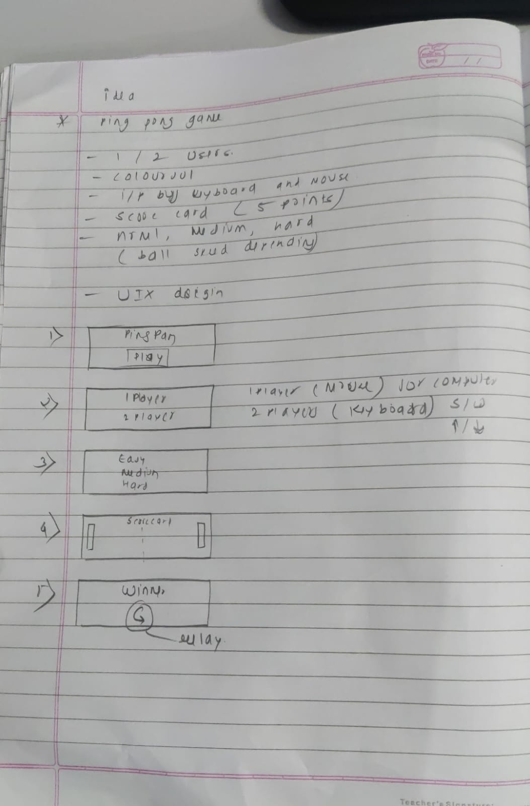

# SKILL LAB PRATICAL HACKATHON
## Final Project README
> **Project Weight:** 100%  
> **Team Size:** 4 students  
> **Project Duration:** 16 hours  
> **Total Time Available:** 32 effort-hours per team  
> **Project Type:** Playful, interactive, technology-based experience
# How to use this README
This file is your team’s **working project document**.
You must keep updating it throughout the build period.  
By the final review, this README should clearly show:
- your idea,
- your planning,
- your design decisions,
- your technical process,
- your build progress,
- your testing,
- your failures and changes,
- your final outcome.
## Rules
- Fill every section.
- Do not delete headings.
- If something does not apply, write `Not applicable` and explain why.
- Add images, screenshots, sketches, links, and videos wherever useful.
- Update task status and weekly logs regularly.
- Use this file as evidence of process, not only as a final report.
---
# 1. Team Identity

## 1.1 Studio / Group Name

`RPi_Pirates`

## 1.2 Team Members

| Name                  | Primary Role                  | Secondary Role   | Strengths Brought to the Project |
| --------------------- | ------------------------------| --------------   | -------------------------------- |
| `Pragnya Sahoo`       | `UI interface / App `         | `Documentation`  | `Documentation, Gift of Gab `    |
| `Sudarsana Krishnan`  | `Coding / App `               | `Documentation`  | `Material Handling, Hardware`    |
| `Aditi Panigrahi`     | `UI interface / App `         | `Documentation`  | `Documentation, Gift of Gab `    |
| `Shabarinath Nair`    | ` Coding / App `              | `Documentation`  | `Material Handling, Hardware`    |

## 1.3 Project Title

`"Implementing Ping Pong game using RasPi"`

## 1.4 One-Line Pitch

`An interactive, multi-controller ping pong game powered by Raspberry Pi, combining keyboard and mobile inputs with dynamic gameplay and real-time scoring.`

## 1.5 Expanded Project Idea

This project is an interactive digital ping pong game that integrates a PC-based game environment with a Raspberry Pi-enabled controller system. The game allows two players to compete using different input methods like keyboard controls and a mobile phone acting as a controller. It includes engaging gameplay features such as a pre-game countdown, real-time scoreboard with player names and a win condition where the first player to reach five points is declared the winner. Additionally, the game introduces increasing difficulty levels by gradually accelerating the ball speed every few seconds, enhancing competitiveness and excitement.
The experience created is dynamic and engaging, encouraging physical interaction and quick reflexes while maintaining simplicity in design. The project combines multiple technologies, including Python and Pygame for game development, Raspberry Pi for handling external inputs, and mobile connectivity for controller interaction. This integration demonstrates how hardware and software can work together to create an interactive gaming system, blending traditional gameplay with modern, flexible input methods.

# 2. Inspiration

## 2.1 References
| Source Type | Title / Link                                                        | What Inspired You                                                                         |
| ----------- | ------------------------------------------------------------------- | ----------------------------------------------------------------------------------------- |
| `[Video]`   | `(https://www.youtube.com/watch?v=5NkTzvMchMw)o` | `How projection mapping can be used to create interactive digital + physical experiences` 
| `[Game]`    |  `Classic Pong Game ` | `Simple yet engaging gameplay mechanics and competitive two-player interaction `
|`[Technology]`|	`Raspberry Pi`	| `Using hardware like Raspberry Pi to extend traditional computer-based systems`
|`[Concept]`|	`Mobile as Game Controller`| `Using a smartphone as an alternative input device instead of standard controllers`

## 2.2 Original Twist
The originality of our project lies in combining a classic ping pong game with modern, multi-device interaction. Unlike traditional Pong, which relies only on keyboard input, our system integrates a Raspberry Pi to enable a mobile phone to function as a controller alongside keyboard controls. This creates a hybrid interaction model that blends physical and digital inputs.
Additionally, the game introduces dynamic gameplay elements such as increasing ball speed over time, a structured countdown before gameplay, and a personalized scoreboard displaying player names with a defined win condition. The project is further unique in its potential as an interactive installation, where users engage with the system through multiple interfaces, making the experience more immersive and flexible compared to standard desktop games.  

# 3. Project Intent

## 3.1 User Journey 
A user opens the Ping Pong Game on their device and is greeted with a visually engaging home screen featuring a playful ping pong theme. The title of the game is displayed along with a prominent “Play” button. Curious and excited, the user clicks on the Play button to begin.
Next, the user is taken to a game mode selection screen, where they can choose between One Player and Two Players. If the user wants to play alone, they select One Player, where they will compete against the computer. If they want to play with a friend, they select Two Players.
In the case of Two Player mode, the system asks both players to enter their names. After entering the names, they proceed further. The controls are clearly shown: Player 1 uses W and S keys, while Player 2 uses the Up and Down arrow keys. After selecting the mode, the user moves to the level selection screen, where they choose the difficulty of the game — Easy, Medium, or Hard — depending on their comfort level. The difficulty affects the speed of the ball and the gameplay intensity.
Once the level is selected, the game starts. A rectangular game area appears with two paddles and a moving ball. A scoreboard is displayed at the top, showing the current scores of both players. The user controls their paddle and tries to hit the ball back and forth. Each time a player misses the ball, the opponent gains a point. A sound effect plays whenever the ball hits a paddle, enhancing the gaming experience.
During the game, the user can press ‘P’ to pause or ‘ESC’ to exit if needed. As the game continues, the scoreboard updates dynamically. When one of the players reaches 5 points, the game ends, and a winner screen is displayed showing the winner’s name and final score. Finally, the user can press ‘R’ to replay, which brings them back to the home screen, ready to start a new game.
                                   
# 4. Definition of Success

## 4.1 Definition of “Usable”
 The project is considered usable when a user can easily navigate through all the screens and successfully play the ping pong game without confusion.
A usable system should:
1. Allow the user to start the game from the home screen
2. Let the user choose between one player and two player modes
3. Enable smooth input of player names (for two-player mode)
4. Allow selection of difficulty level (easy, medium, hard)
5. Provide clear controls for gameplay (keyboard/mouse)
6. Display a working game screen with paddles, ball, and scoreboard
7. Update the score correctly when a point is made
8. Show a winner screen when a player reaches 5 points
9. Allow the user to pause, exit, and replay the game
10. If the user can complete a full game cycle (start → play → win → replay), the system is considered usable

## 4.2 Minimum Usable Version

The minimum usable version is the simplest version of the game that still provides the core experience of playing ping pong.
It includes:
1. Basic home screen with Play button
2. Selection of one player mode only (no need for two-player initially)
3. Simple game screen with one paddle (user) and one computer paddle
4. Basic ball movement and collision logic
5. A simple scoreboard
6. Game ends when one player reaches 5 points
7. Display of a basic winner message
This version does not require advanced UI design, sound effects, or animations but must allow the user to play and complete a full game.

## 4.3 Stretch Features
 
Stretch features are additional improvements that enhance the game but are not required for the basic functionality.
These include:
1. Two-player mode with custom player names
2. Sound effects (ball hit, scoring, win sound)
3. Pause and resume feature (P key)
4. Exit option (ESC key)
5. Replay option (R key)
6. Improved UI/UX design with themes (space/pixel style)
7. Mobile-responsive design
8. Difficulty levels (easy, medium, hard) with increasing ball speed
9. Animations (ball trail, paddle movement effects)
10. Score history or leaderboard
11. Touch controls for mobile devices
These features make the game more engaging and professional but are not necessary for the core gameplay.

# 5. System Overview

## 5.1 Project Type

Check all that apply.

- [x] Electronics-based

- [ ] Mechanical

- [x] Sensor-based

- [ ] App-connected

- [ ] Motorized

- [ ] Sound-based

- [ ] Light-based

- [x] Screen/UI-based

- [ ] Fabricated structure

- [x] Game logic based

- [ ] Installation

- [ ] Other:

## 5.2 High-Level System Description

The Ping Pong Game is a screen-based interactive system where the user plays a digital version of ping pong either against the computer or another player.
The system works as follows:
Input: The user provides input using keyboard keys (W, S, Arrow keys) or mouse (in one-player mode). The user also selects game mode, difficulty level, and enters player names.
Processing: The system processes user inputs and runs the game logic. It controls the movement of paddles, calculates the ball’s direction, detects collisions between the ball and paddles/walls, updates scores, and determines when a player wins.
Output: The output is displayed on the screen in the form of a game interface. It shows the paddles, moving ball, scoreboard, and winner message. Sound effects may also play when the ball hits a paddle or when a player scores.
Physical Structure: The system is software-based and runs on devices like a computer or mobile screen. There is no physical hardware structure required apart from input devices (keyboard/mouse).
App Interaction: The game can run as a web application or local application. The user interacts through UI screens such as home screen, game mode selection, gameplay screen, and result screen.
 
## 5.3 Input / Output Map

| System Part          | Type       | What It Does
|----------------------|------------|----------------------------------------
| Play Button          | Input      | Starts the game
| Mode Selection       | Input      | Chooses one-player or two-player mode
| Name Input Fields    | Input      | Takes player names
| Keyboard (W, S, ↑, ↓)| Input      | Controls paddle movement
| Mouse                | Input      | Controls paddle in one-player mode 
| Level Selection      | Input      | Sets difficulty (ball speed)
| Game Logic Engine    | Processing | Handles movement, collision, scoring
| Ball Movement        | Processing | Calculates direction and speed
| Collision Detection  | Processing | Detects ball hitting paddle/walls
| Scoreboard           | Output     | Displays player scores
| Game Screen          | Output     | Shows paddles, ball, gameplay
| Winner Screen        | Output     | Displays winner and final score
| Sound System         | Output     | Plays sound on hit/score

# 6. System Design, Sketches and Visual Planning 

## 6.1 Concept Architecture/sketch/schematic

## 6.2 Labeled Build Sketch/architecture/flow diagram/algorithm

Add a sketch with labels showing:

- structure,
- electronics placement,
- user touch points,
- moving parts,
- output elements.

**Insert image below:**  

## 6.3 Approximate Dimensions
Not Applicable (NA) – The project is primarily a software-based interactive game and does not involve a fixed or dedicated physical structure with defined dimensions. The system runs on a computer display and uses external devices such as a keyboard and mobile phone for input. While a Raspberry Pi is used for input integration, it is not enclosed within a custom-built physical form factor. Therefore, standard dimensions like length, width, height, and weight are not relevant to this project.

# 7. Electronics Planning

## 7.1 Electronics Used

| Component                | Quantity | Purpose                                          |
|--------------------------|----------|--------------------------------------------------|
| Raspberry Pi             | 1        | Acts as interface between phone controller and PC|
| Mobile Phone             | 1        | Sends control inputs (up/down)                   |
| Wi-Fi Network            | 1        | Enables communication between phone and Pi       |
| PC / Laptop              | 1        | Runs game logic and display (Pygame)             |
| Display Screen/Monitor   | 1        | Shows gameplay, scoreboard, and UI               |
| Keyboard                 | 1        | Controls paddle movement (Player input)          |

## 7.2 Wiring Plan

Describe the main electrical connections.

**sample Response:**  
`The RASPI is connected to the motor driver (L298N) using four GPIO pins (18,19; 22,23) to control motor direction (IN1, IN2, IN3, IN4). Two PWM-capable pins (ENA and ENB; 25 and 26) are connected to control the speed of each motor.

The motors are connected to the output terminals of the motor driver. The motor driver is powered directly by the battery pack (higher voltage), while the ESP32 receives regulated 5V from the buck converter.

All components share a common ground to ensure stable operation. The projector and camera are connected to the laptop, which handles tracking and game logic separately.`

## 7.3 Circuit Diagram/architecture diagram

Insert a hand-drawn or software-made circuit diagram.

**Insert image below:**  
`[Upload image and link here]`

# 7.4. Power Plan

| Question         | Response                                                                                                                                          |
| ---------------- | ------------------------------------------------------------------------------------------------------------------------------------------------- |
| Power source     | `Battery (Li-ion pack)`                                                                                                                           |
| Voltage required | `~6–8.4V for motors (via driver), stepped down to 5V for ESP32 (buck converter)`                                                                  |
| Current concerns | `Motors can draw high current under load, which may cause voltage drops affecting ESP32 and WiFi stability`                                       |
| Safety concerns  | `Avoid over-discharging Li-ion batteries, ensure proper voltage regulation, prevent short circuits, and secure wiring to avoid loose connections` |

---

# 8. Software Planning/

## 8.1 Software Tools

| Tool / Platform                | Purpose                                        |
| ------------------------------ | ---------------------------------------------- |
| `[MicroPython]`                | `Control ESP32`                                |
| `[Python/PyGame/OpenCV]`       | `Track markers, game logic, create projection` |
| `[Fusion/Blender/Illustrator]` | `[Prototyping structure]`                      |
|                                |                                                |

## 8.2 Software Logic/Algorithm

Describe what the code must do.

Include:

- startup behavior,
- input handling,
- sensor reading,
- decision logic,
- output behavior,
- communication logic,
- reset behavior.

**Response:**  
`

- **Sample Startup behavior:**  
  The Raspi/FPGA initializes motor pins, PWM control, and starts a WiFi access point with a web server. The laptop initializes camera input, tracking system, and projection mapping.
- **Input handling:**  
  Movement commands are received from the laptop (pygame sends http requests)
- **Sensor reading:**  
  The camera continuously captures frames, and OpenCV detects ArUco markers to determine the car’s position and orientation.
- **Decision logic:**  
  The system maps the car’s position into a virtual coordinate system and checks for nearby obstacles or collisions. If movement is valid, the command is allowed; if not, it is blocked or replaced with a feedback action (like a slight shake).
- **Output behavior:**  
  The ESP32 drives the motors using PWM signals to control speed and direction. The projector displays the updated game environment, including obstacles, targets, and feedback visuals.
- **Communication logic:**  
  The laptop sends HTTP requests (e.g., `/forward`, `/left`) to the ESP32 over WiFi. The ESP32 parses these commands and executes motor actions.
- **Reset behavior:**  
  If no command is received within a short timeout, the ESP32 stops the motors. The game resets when a level is completed or restarted.`

## 8.3 Code Flowchart

Insert a flowchart showing your code logic.

Suggested sequence:

- start,
- initialize,
- wait for input,
- read input,
- decision,
- trigger output,
- repeat or reset,
- error handling.

**Insert image below:**  

# 9. Bill of Materials

## 9.1 Full BOM

| Item                             | Quantity | In Kit? | Need to Buy? | Estimated Cost | Material / Spec               | Why This Choice?          |
| -------------------------------- | --------:| ------- | ------------ | --------------:| ----------------------------- | ------------------------- |
| `[RASPI]`                        | `1`      | `Yes`   | `No`         | `0`            | `38 Pin ESP32`                | `[To control components]` |
| `[Motor Driver]`                 | `[1]`    | `[Yes]` | `[No]`       | `0`            | `[LN296]`                     | `[To drive both motors]`  |
| `[DC Motors and wheel]`          | `[2]`    | `[No]`  | `[Yes]`      | `[150]`        | `[BO Motors and 6 cm wheels]` | `[high torque motors]`    |
| `[Buck Converter]`               | `[1]`    | `[No]`  | `[Yes]`      | `[75]`         |                               |                           |
| `[Li-ion batteries with holder]` | `[1]`    | `[No]`  | `[Yes]`      | `[200]`        |                               |                           |

## 9.2 Material Justification

Explain why you selected your main materials and components.

**Response:**  
`DC motors (BO motors) were chosen instead of servos or steppers because the system requires continuous rotation for movement rather than precise angular control (Previously, we were considering using steppers as we were planning on tracking movement on the ESP using its relative position from an origin, but since we're using a camera now, this is not required). A motor driver (L298N) was used to allow bidirectional control and speed variation using PWM.`

## 9.3 Items You chose

| Item                 | Why Needed               | Purchase Link | Latest Safe Date to Procure | Status       |
| -------------------- | ------------------------ | ------------- | --------------------------- | ------------ |
| `BO Motors + Wheels` | `Drive system for car`   | `robu.in`     | `15th April`                | `[Received]` |
| `Buck Converter`     | `Stable power for ESP32` | `local store` | `before testing`            | `[Received]` |
| `Li-ion Batteries`   | `Portable power`         | `local store` | `before testing`            | `Recieved`   |

## 9.4 Budget Summary

| Budget Item           | Estimated Cost              |
| --------------------- | ---------------------------:|
| Electronics           | `[400]`                     |
| Mechanical parts      | `[200]`                     |
| Fabrication materials | `[0 (Available on campus)]` |
| Purchased extras      | `[0]`                       |
| Contingency           | `[300]`                     |
| **Total**             | `[900]`                     |

## 9.5 Budget Reflection

If your cost is too high, what can be simplified, removed, substituted, or shared?

**Response:**  

---

# 10. Planning the Work

## 10.1 Team Working Agreement

Write how your team will work together.

Include:

- how tasks are divided,
- how decisions are made,
- how progress will be checked,
- what happens if a task is delayed,
- how documentation will be maintained.

**Response:**  

## 10.2 Task Breakdown

| Task ID | Task                    | Owner    | Estimated Hours | Deadline     | Dependency | Status |
| ------- | ----------------------- | -------- | ---------------:| ------------ | ---------- | ------ |
| T1      | `[Finalize concept]`    | `[Both]` | `2`             | `1st April`  | `None`     | `Done` |

## 10.3 Responsibility Split

| Area                 | Main Owner     | Support Owner |
| -------------------- | ----------     | ------------- |
| Concept              | `[Mrugendra]`  | `[Jyoti]`     |
| Electronics          | `[]`           | `[]`          |
| Coding               | `[]`           | `[]`          |
| Mechanical build     | `[]`           | `[]`          |
| Testing              | `[]`           | `[]`          |
| Documentation        | `[]`           | `[]`          |

---

# 11 hour Milestones

## 11.1 8-hour Plan(tentetively you may set)

### Bi Hour 1 — Plan and De-risk

Expected outcomes:

- [x] Idea finalized
- [x] Core interaction decided
- [x] Sketches made
- [x] BOM completed
- [x] Purchase needs identified
- [ ] Key uncertainty identified
- [x] Basic feasibility tested

### Bi Hour 2 — Build Subsystems

Expected outcomes:

- [x] Electronics tests completed
- [ ] CAD / structure planning completed
- [ ] App UI started if needed
- [x] Mechanical concept tested
- [x] Main subsystems partially working

### Bi Hour 3 — Integrate

Expected outcomes:

- [x] Physical body built
- [x] Electronics integrated
- [x] Code connected to hardware
- [ ] App connected if required
- [x] First playable version exists

### Bi Hour 4 — Refine and Finish

Expected outcomes:

- [x] Technical bugs reduced
- [x] Playtesting completed
- [x] Improvements made
- [x] Documentation completed
- [x] Final build ready

## 12.2  Update Log

| Days   | Planned Goal   | What Actually Happened | What Changed   | Next Steps     |
| ------ | -------------- | ---------------------- | -------------- | -------------- |
| Day 1 | `[Write here]` | `[Write here]`         | `[Write here]` | `[Write here]` |
| Day 2 | `[Write here]` | `[Write here]`         | `[Write here]` | `[Write here]` |
| Day 3 | `[Write here]` | `[Write here]`         | `[Write here]` | `[Write here]` |
| Day 4 | `[Write here]` | `[Write here]`         | `[Write here]` | `[Write here]` |

---

# 13. Risks and Unknowns

## 13.1 Risk Register

| Risk                                                            | Type         | Likelihood | Impact   | Mitigation Plan                                                                       | Owner                |
| --------------------------------------------------------------- | ------------ | ---------- | -------- | ------------------------------------------------------------------------------------- | -------------------- |
| WiFi connection between laptop and ESP32 becomes unstable       | `Technical`  | `Medium`   | `High`   | Keep ESP32 close, ensure stable power supply, reduce network load, add fail-safe stop | `[Gopal]`           |

## 13.2 Biggest Unknown Right Now

What is the single biggest uncertainty in your project at this stage?

**Response:**  

---

# 14. Testing 

## 14.1 Technical Testing Plan

| What Needs Testing     | How You Will Test It                                                                 | Success Condition                                                                                    |
| ---------------------- | ------------------------------------------------------------------------------------ | ---------------------------------------------------------------------------------------------------- |
| `[Wifi connection]`    | `[Check if motor spins via app button]`                                              | `[Both motors accurately respond to wifi signals]`                                                   |
                       |
## 14.2 Testing and Debugging Log

| Date          | Problem Found                         | Type         | What You Tried                                | Result               | Next Action                                    |
| ------------- | ------------------------------------- | ------------ | --------------------------------------------- | -------------------- | ---------------------------------------------- |
| `18th April`  | `Car not balancing properly`          | `Mechanical` | `Add low-friction caster support to one side` | `Worked`             | `improve caster structure`                     |

## 14.3 Playtesting Notes

| Tester      | What They Did                        | What Confused Them                    | What They Enjoyed                         | What You Will Change                          |
| ----------- | ------------------------------------ | ------------------------------------- | ----------------------------------------- | --------------------------------------------- |
| `Gopal` | `Tried navigating through obstacles` | `Some obstacles ewren't clear enough` | `Liked projection + real car interaction` | `Add a slight red highlight around obstacles` |

---

# 15. Build Documentation

## 15.1 Fabrication Process(if any)

Describe how the project was physically made.

Include:

- cutting,
- 3D printing,
- assembly,
- fastening,
- wiring,
- finishing,
- revisions.

**Response:**  
`The fabrication process involved designing, manufacturing, assembling, and refining both the physical structure and electronic integration of the system.`

`Design (CAD Modeling):
The initial model was created using CAD software, where components were designed based on the actual dimensions of the electronic parts. This ensured accurate fitting and minimized errors during assembly.
Cutting (Laser Cutting):
The designed parts were fabricated using laser cutting techniques. Sheets were cut precisely according to the CAD model to create the structural base and mounts for components.`

`Components were fixed using adhesives and mechanical supports. Certain parts were intentionally kept modular (not permanently fixed) to allow easy replacement and modification of electronics.
Surface Finishing:
Some parts were sanded to smooth rough edges after cutting. Sawdust mixed with adhesive was used to fill gaps and uneven edges, improving structural finish. The final structure was then painted for better aesthetics and durability.`

`Environment Setup (Dark Room Fabrication):
To enhance projection visibility, a controlled dark environment was created using Z-boards, paper sheets, and bedsheets. This minimized external light interference and improved projection clarity.
Revisions and Iterations:
Multiple adjustments were made throughout the process, including refining alignment, improving structural stability, repositioning components, and optimizing the interaction between the physical car and projected environment.`

## 16 Build Photos

Add photos throughout the project.

Suggested images:

- early sketch,
- prototype,
- electronics testing,
- mechanism test,
- app screenshot,
- final build.
- 

# 17. Final Outcome

## 17.1 Final Description

Describe the final version of your project.

**Response:**  

## 17.2 What Works Well

## 17.3 What Still Needs Improvement

## 17.4 What Changed From the Original Plan

How did the project change from the initial idea?

**Response:**  

---

# 18. Reflection

## 18.1 Team Reflection

What did your team do well?  
What slowed you down?  
How well did you manage time, tasks, and responsibilities?

**Response:**  

## 18.2 Technical Reflection

What did you learn about:

- electronics,
- coding,
- mechanisms,
- fabrication,
- integration?

**Response:**  

## 18.3 Design Reflection

What did you learn about:

- designing ,
- delight,
- clarity,
- physical interaction,
- understanding,
- iteration?

**Response:**  

## 18.4 If You Had One More hour

What would you improve next?

**Response:**  

` `

---

# 19. Final Submission Checklist

Before submission, confirm that:

- [x] Team details are complete
- [x] Project description is complete
- [x] Inspiration sources are included
- [x] Sketches are added
- [x] BOM is complete
- [x] Purchase list is complete
- [x] Budget summary is complete
- [x] Mechanical planning is documented if applicable
- [ ] App planning is documented if applicable
- [x] Code flowchart is added
- [x] Task breakdown is complete
- [x] Weekly logs are updated
- [x] Risk register is complete
- [x] Testing log is updated
- [x] Playtesting notes are included
- [x] Build photos are included
- [x] Final reflection is written

---

---

