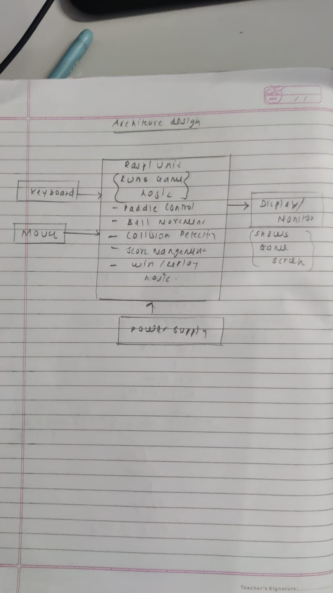
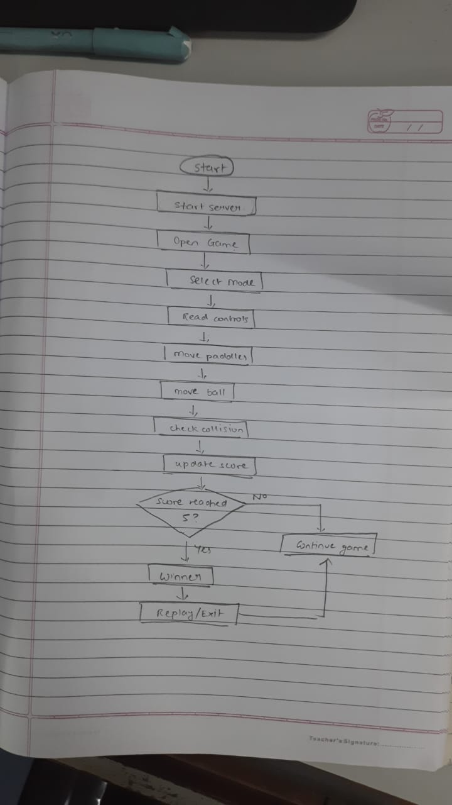

# SKILL LAB PRATICAL HACKATHON
## Final Project README
> **Project Weight:** 100%  
> **Team Size:** 4 students  
> **Project Duration:** 16 hours  
> **Total Time Available:** 32 effort-hours per team  
> **Project Type:** Playful, interactive, technology-based experience
# How to use this README
This file is your team’s **working project document**.
You must keep updating it throughout the build period.  
By the final review, this README should clearly show:
- your idea,
- your planning,
- your design decisions,
- your technical process,
- your build progress,
- your testing,
- your failures and changes,
- your final outcome.
## Rules
- Fill every section.
- Do not delete headings.
- If something does not apply, write `Not applicable` and explain why.
- Add images, screenshots, sketches, links, and videos wherever useful.
- Update task status and weekly logs regularly.
- Use this file as evidence of process, not only as a final report.
---
# 1. Team Identity

## 1.1 Studio / Group Name

`RPi_Pirates`

## 1.2 Team Members

| Name                  | Primary Role                  | Secondary Role   | Strengths Brought to the Project |
| --------------------- | ------------------------------| --------------   | -------------------------------- |
| `Pragnya Sahoo`       | `UI interface / App `         | `Documentation`  | `Documentation, Gift of Gab `    |
| `Sudarsana Krishnan`  | `Coding / App `               | `Documentation`  | `Material Handling, Hardware`    |
| `Aditi Panigrahi`     | `UI interface / App `         | `Documentation`  | `Documentation, Gift of Gab `    |
| `Shabarinath Nair`    | ` Coding / App `              | `Documentation`  | `Material Handling, Hardware`    |

## 1.3 Project Title

`"Implementing Ping Pong game using RasPi"`

## 1.4 One-Line Pitch

`An interactive, multi-controller ping pong game powered by Raspberry Pi, combining keyboard and mobile inputs with dynamic gameplay and real-time scoring.`

## 1.5 Expanded Project Idea

This project is an interactive digital ping pong game that integrates a PC-based game environment with a Raspberry Pi-enabled controller system. The game allows two players to compete using different input methods like keyboard controls and a mobile phone acting as a controller. It includes engaging gameplay features such as a pre-game countdown, real-time scoreboard with player names and a win condition where the first player to reach five points is declared the winner. Additionally, the game introduces increasing difficulty levels by gradually accelerating the ball speed every few seconds, enhancing competitiveness and excitement.
The experience created is dynamic and engaging, encouraging physical interaction and quick reflexes while maintaining simplicity in design. The project combines multiple technologies, including Python and Pygame for game development, Raspberry Pi for handling external inputs, and mobile connectivity for controller interaction. This integration demonstrates how hardware and software can work together to create an interactive gaming system, blending traditional gameplay with modern, flexible input methods.

# 2. Inspiration

## 2.1 References
| Source Type | Title / Link                                                        | What Inspired You                                                                         |
| ----------- | ------------------------------------------------------------------- | ----------------------------------------------------------------------------------------- |
| `[Video]`   | `(https://www.youtube.com/watch?v=5NkTzvMchMw)o` | `How projection mapping can be used to create interactive digital + physical experiences` 
| `[Game]`    |  `Classic Pong Game ` | `Simple yet engaging gameplay mechanics and competitive two-player interaction `
|`[Technology]`|	`Raspberry Pi`	| `Using hardware like Raspberry Pi to extend traditional computer-based systems`
|`[Concept]`|	`Mobile as Game Controller`| `Using a smartphone as an alternative input device instead of standard controllers`

## 2.2 Original Twist
The originality of our project lies in combining a classic ping pong game with modern, multi-device interaction. Unlike traditional Pong, which relies only on keyboard input, our system integrates a Raspberry Pi to enable a mobile phone to function as a controller alongside keyboard controls. This creates a hybrid interaction model that blends physical and digital inputs.
Additionally, the game introduces dynamic gameplay elements such as increasing ball speed over time, a structured countdown before gameplay, and a personalized scoreboard displaying player names with a defined win condition. The project is further unique in its potential as an interactive installation, where users engage with the system through multiple interfaces, making the experience more immersive and flexible compared to standard desktop games.  

# 3. Project Intent

## 3.1 User Journey 
A user opens the Ping Pong Game on their device and is greeted with a visually engaging home screen featuring a playful ping pong theme. The title of the game is displayed along with a prominent “Play” button. Curious and excited, the user clicks on the Play button to begin.
Next, the user is taken to a game mode selection screen, where they can choose between One Player and Two Players. If the user wants to play alone, they select One Player, where they will compete against the computer. If they want to play with a friend, they select Two Players.
In the case of Two Player mode, the system asks both players to enter their names. After entering the names, they proceed further. The controls are clearly shown: Player 1 uses W and S keys, while Player 2 uses the Up and Down arrow keys. The difficulty affects the speed of the ball and the gameplay intensity.
Once the level is selected, the game starts. A rectangular game area appears with two paddles and a moving ball. A scoreboard is displayed at the top, showing the current scores of both players. The user controls their paddle and tries to hit the ball back and forth. Each time a player misses the ball, the opponent gains a point. A sound effect plays whenever the ball hits a paddle, enhancing the gaming experience.
During the game, the user can press ‘P’ to pause or ‘ESC’ to exit if needed. As the game continues, the scoreboard updates dynamically. When one of the players reaches 5 points, the game ends, and a winner screen is displayed showing the winner’s name and final score. Finally, the user can press ‘R’ to replay, which brings them back to the home screen, ready to start a new game.
                                   
# 4. Definition of Success

## 4.1 Definition of “Usable”
 The project is considered usable when a user can easily navigate through all the screens and successfully play the ping pong game without confusion.
A usable system should:
1. Allow the user to start the game from the home screen
2. Let the user choose between one player and two player modes
3. Enable smooth input of player names (for two-player mode)
4. Allow selection of difficulty level (easy, medium, hard)
5. Provide clear controls for gameplay (keyboard/mouse)
6. Display a working game screen with paddles, ball, and scoreboard
7. Update the score correctly when a point is made
8. Show a winner screen when a player reaches 5 points
9. Allow the user to pause, exit, and replay the game
10. If the user can complete a full game cycle (start → play → win → replay), the system is considered usable

## 4.2 Minimum Usable Version

The minimum usable version is the simplest version of the game that still provides the core experience of playing ping pong.
It includes:
1. Basic home screen with Play button
2. Selection of one player mode only (no need for two-player initially)
3. Simple game screen with one paddle (user) and one computer paddle
4. Basic ball movement and collision logic
5. A simple scoreboard
6. Game ends when one player reaches 5 points
7. Display of a basic winner message
This version does not require advanced UI design, sound effects, or animations but must allow the user to play and complete a full game.

## 4.3 Stretch Features
 
Stretch features are additional improvements that enhance the game but are not required for the basic functionality.
These include:
1. Two-player mode with custom player names
2. Sound effects (ball hit, scoring, win sound)
3. Pause and resume feature (P key)
4. Exit option (ESC key)
5. Replay option (R key)
6. Improved UI/UX design with themes (space/pixel style)
7. Mobile-responsive design
8. Difficulty levels (easy, medium, hard) with increasing ball speed
9. Animations (ball trail, paddle movement effects)
10. Score history or leaderboard
11. Touch controls for mobile devices
These features make the game more engaging and professional but are not necessary for the core gameplay.

# 5. System Overview

## 5.1 Project Type

Check all that apply.

- [x] Electronics-based

- [ ] Mechanical

- [x] Sensor-based

- [ ] App-connected

- [ ] Motorized

- [ ] Sound-based

- [ ] Light-based

- [x] Screen/UI-based

- [ ] Fabricated structure

- [x] Game logic based

- [ ] Installation

- [ ] Other:

## 5.2 High-Level System Description

The Ping Pong Game is a screen-based interactive system where the user plays a digital version of ping pong either against the computer or another player.
The system works as follows:
Input: The user provides input using keyboard keys (W, S, Arrow keys) or mouse (in one-player mode). The user also selects game mode, difficulty level, and enters player names.
Processing: The system processes user inputs and runs the game logic. It controls the movement of paddles, calculates the ball’s direction, detects collisions between the ball and paddles/walls, updates scores, and determines when a player wins.
Output: The output is displayed on the screen in the form of a game interface. It shows the paddles, moving ball, scoreboard, and winner message. Sound effects may also play when the ball hits a paddle or when a player scores.
Physical Structure: The system is software-based and runs on devices like a computer or mobile screen. There is no physical hardware structure required apart from input devices (keyboard/mouse).
App Interaction: The game can run as a web application or local application. The user interacts through UI screens such as home screen, game mode selection, gameplay screen, and result screen.
 
## 5.3 Input / Output Map

| System Part          | Type       | What It Does
|----------------------|------------|----------------------------------------
| Play Button          | Input      | Starts the game
| Mode Selection       | Input      | Chooses one-player or two-player mode
| Name Input Fields    | Input      | Takes player names
| Keyboard (W, S, ↑, ↓)| Input      | Controls paddle movement
| Mouse                | Input      | Controls paddle in one-player mode 
| Level Selection      | Input      | Sets difficulty (ball speed)
| Game Logic Engine    | Processing | Handles movement, collision, scoring
| Ball Movement        | Processing | Calculates direction and speed
| Collision Detection  | Processing | Detects ball hitting paddle/walls
| Scoreboard           | Output     | Displays player scores
| Game Screen          | Output     | Shows paddles, ball, gameplay
| Winner Screen        | Output     | Displays winner and final score
| Sound System         | Output     | Plays sound on hit/score

# 6. System Design, Sketches and Visual Planning 

## 6.1 Concept sketch
The sketch illustrates the user interface flow and screen layout of the ping pong game. It begins with a simple home screen displaying the game title and a play button, ensuring ease of navigation. The next screen allows the user to select between single-player (mouse or AI-based opponent) and two-player mode (keyboard controls). A level selection screen follows, offering options such as easy, medium, and hard, which affect gameplay speed. The main gameplay screen includes paddles on both sides, a moving ball, and a centrally positioned scoreboard that tracks points up to a maximum of five. Finally, a winner screen is displayed once a player reaches the target score, with an option to replay the game. The design focuses on clarity, simplicity, and intuitive interaction for an engaging user experience.

## 6.2 Labeled flow diagram
The flowchart represents the logical sequence of operations in the ping pong game system. The process begins with the start state, followed by the home screen where the user initiates the game by clicking the play button. The user then selects the game mode (single-player or two-player). If two-player mode is chosen, player names are entered. Next, the user selects the difficulty level (easy, medium, or hard), after which the game begins with a countdown. During gameplay, the system continuously updates ball movement, paddle positions, and scores. A decision condition checks whether any player has reached the winning score (5 points). If not, the game continues; otherwise, the winner is declared. The system then provides an option to replay or return to the home screen, completing the cycle.
**Insert image below:**  

## 6.3 Approximate Dimensions
Not Applicable (NA) – The project is primarily a software-based interactive game and does not involve a fixed or dedicated physical structure with defined dimensions. The system runs on a computer display and uses external devices such as a keyboard and mobile phone for input. While a Raspberry Pi is used for input integration, it is not enclosed within a custom-built physical form factor. Therefore, standard dimensions like length, width, height, and weight are not relevant to this project.

# 7. Electronics Planning

## 7.1 Electronics Used

| Component                | Quantity | Purpose                                          |
|--------------------------|----------|--------------------------------------------------|
| Raspberry Pi             | 1        | Acts as interface between phone controller and PC|
| Mobile Phone             | 1        | Sends control inputs (up/down)                   |
| Wi-Fi Network            | 1        | Enables communication between phone and Pi       |
| PC / Laptop              | 1        | Runs game logic and display (Pygame)             |
| Display Screen/Monitor   | 1        | Shows gameplay, scoreboard, and UI               |
| Keyboard                 | 1        | Controls paddle movement (Player input)          |

## 7.2 Wiring Plan
The system does not involve complex electrical wiring, as it is primarily based on wireless communication and software integration. The Raspberry Pi, mobile phone, and PC are connected through a common Wi-Fi network.
The mobile phone acts as a controller and sends input commands wirelessly to the Raspberry Pi. The Raspberry Pi processes these inputs and forwards them to the PC, where the main game logic is executed using Python and Pygame.
The keyboard is directly connected to the PC and is used for player input in multiplayer mode. The PC is connected to a display screen, which shows the gameplay, including paddles, ball movement, scoreboard, and countdown.
Since there are no high-power components or dedicated circuits, a common electrical ground or physical wiring between components is not required. The system relies entirely on network-based communication for interaction between devices

## 7.3 Circuit architecture diagram
The Ping Pong Game system is designed using a Raspberry Pi as the main processing unit, which controls the entire gameplay. The system takes input from devices such as a keyboard and mouse, where the keyboard is used in two-player mode and the mouse is used in one-player mode to control the paddles. These inputs are processed by the Raspberry Pi, which runs the game logic using software (Python and Pygame). It performs operations such as paddle movement, ball movement, collision detection, score calculation, and winner determination. The processed output is then displayed on a monitor, where the user can visually interact with the game. The system follows a simple input–process–output model, making it efficient and easy to understand.
**Insert image below:**  

# 7.4. Power Plan

| Question         | Response                                                                                                                |
|------------------|-------------------------------------------------------------------------------------------------------------------------|
| Power source     | `Laptop/PC power supply and Raspberry Pi power adapter (5V USB supply)`                                                 |
| Voltage required | `5V for Raspberry Pi; standard power for PC/laptop and mobile phone`                                                    |
| Current concerns | `Stable power supply required for Raspberry Pi to ensure reliable communication; low overall current consumption`       |
| Safety concerns  | `Use certified power adapters, avoid overloading USB ports, and ensure proper ventilation for devices during operation` |

# 8. Software Planning/

## 8.1 Software Tools

| Tool / Platform        | Purpose                                                   |
|------------------------|---------------------------------------------------------- |
| Python                 | Core programming language for game development            |
| Pygame                 | Game development, rendering graphics, handling input      |
| Raspberry Pi OS        | Runs scripts to receive and forward controller inputs     |
| Socket / HTTP (Wi-Fi)  | Communication between phone, Raspberry Pi, and PC         |
| Mobile Browser/App     | Acts as controller interface (send up/down inputs)        |                             |                                               

## 8.2 Software Logic/Algorithm
Startup behavior:
The system initializes the Pygame window, game objects (paddles, ball), and sets the initial game state to the home screen. The Raspberry Pi establishes a network connection and begins listening for input signals from the mobile phone controller.
Input handling:
Player inputs are received through the keyboard (W/S keys and arrow keys) and from the mobile phone via the Raspberry Pi. These inputs control the vertical movement of paddles in real time.
Sensor reading:
Not applicable, as the system does not use physical sensors. Instead, it relies on user input signals from keyboard and mobile controller.
Decision logic:
The game continuously updates ball position, detects collisions with paddles and boundaries, and determines scoring conditions. Ball speed increases at fixed time intervals (every 7 seconds) to raise the difficulty level. The system also checks if a player has reached the winning score (5 points).
Output behavior:
The game renders real-time visuals on the screen, including paddle movement, ball motion, countdown timer, scoreboard with player names, and winner announcement.
Communication logic:
The mobile phone sends control inputs over Wi-Fi to the Raspberry Pi. The Raspberry Pi processes and forwards these inputs to the PC game, enabling wireless control of the paddle.
Reset behavior:
After each point, the game enters a short pause state and resets the ball position. A countdown is displayed before the next round begins. The entire game resets when a player reaches 5 points or when the user restarts the game.

## 8.3 Code Flowchart
The flowchart represents the step-by-step working of the Ping Pong Game system. The process begins with the start of the program, after which the home screen is displayed to the user. From the home screen, the user clicks on the play option, which takes them to the mode selection screen where they can choose between one-player or two-player mode.
If the user selects two-player mode, they are required to enter the player names, while in one-player mode this step is skipped. After that, the user selects the difficulty level such as easy, medium, or hard, which determines the speed and complexity of the game.
Once the setup is complete, the game starts, and the main gameplay begins. In this stage, the ball moves continuously, and players control their paddles to hit the ball. The score updates automatically whenever a player misses the ball and the opponent gains a point.
A decision condition is then checked: whether any player has reached 5 points. If no player has reached the winning score, the game continues in a loop. If a player reaches 5 points, the system displays the winner screen, announcing the winner.
Finally, the user is given an option to replay the game, and upon selection, the system returns to the home screen, completing one full cycle of the game flow.
**Insert image below:**  

# 9. Bill of Materials

## 9.1 Full BOM
| Item                     | Quantity | In Kit? | Need to Buy? | Estimated Cost | Material / Spec                | Why This Choice?                               |
|--------------------------|---------:|--------|--------------|---------------:|-------------------------------|--------------------------------------------------|
| Raspberry Pi             | 1        | Yes    | No           | 0              | 5V Micro USB / USB-C powered  | Acts as bridge between phone controller and PC   |
| PC / Laptop              | 1        | Yes    | No           | 0              | Standard system with Python   | Runs game logic using Pygame                     |
| Mobile Phone             | 1        | Yes    | No           | 0              | Android/iOS device            | Used as wireless controller                      |
| Wi-Fi Network            | 1        | Yes    | No           | 0              | Local network connection      | Enables communication between devices            |
| Display Screen/Monitor   | 1        | Yes    | No           | 0              | HDMI-compatible display       | Displays gameplay and UI                         |
| Keyboard                 | 1        | Yes    | No           | 0              | Standard USB keyboard         | Provides player input                            |

## 9.2 Material Justification
The components were selected to support a software-driven interactive game with minimal hardware dependency. The Raspberry Pi was chosen as it provides a compact and efficient platform for handling communication between the mobile phone and the PC. It allows flexible integration of wireless inputs without requiring complex circuitry.
A PC or laptop was used to run the main game logic using Python and Pygame, as it offers sufficient processing power and graphical capabilities. The mobile phone was selected as a controller because it is easily available and enables wireless, user-friendly interaction. A Wi-Fi network is used instead of wired connections to simplify setup and improve flexibility.
Overall, the design avoids unnecessary hardware components such as motors or drivers, making the system cost-effective, simple to implement, and focused on interaction and gameplay rather than mechanical complexity.

## 9.3 Items You chose

| Item               | Why Needed                                       | Purchase Link | Latest Safe Date to Procure | Status      |
|--------------------|--------------------------------------------------|---------------|-----------------------------|-------------|
| Raspberry Pi       | To receive and forward mobile controller input   | Available     | Already available           | Received    |
| Mobile Phone       | Acts as wireless controller                      | Personal      | Already available           | In Use      |
| PC / Laptop        | Runs game logic (Pygame)                         | Personal      | Already available           | In Use      |
| Wi-Fi Network      | Enables communication between devices            | Available     | Already available           | Active      |
| Keyboard           | Player input for gameplay                        | Available     | Already available           | In Use      |

## 9.4 Budget Summary

| Budget Item           | Estimated Cost (₹) |
|-----------------------|-------------------:|
| Electronics           | 0                  |
| Mechanical parts      | 0                  |
| Fabrication materials | 0                  |
| Purchased extras      | 0                  |
| **Total**             | 0                  |

## 9.5 Budget Reflection

The overall cost of the project is minimal because it primarily relies on existing devices such as a PC, Raspberry Pi, and mobile phone. No additional hardware components like motors, drivers, or fabrication materials were required.
If further cost reduction were needed, the Raspberry Pi could be eliminated by directly connecting the mobile controller to the PC using network-based communication, making the system entirely software-based. Additionally, shared devices and open-source tools were used to avoid any licensing or hardware expenses.
This approach demonstrates that interactive systems and games can be developed efficiently without high costs, by leveraging existing resources and focusing on software integration rather than hardware complexity.

# 10. Planning the Work

## 10.1 Team Working Agreement
The team divided responsibilities based on key components of the project. Members Sudarsana and Shabarinath focused on developing the core functionality, including game coding using Pygame and implementing the mobile phone controller through the Raspberry Pi. Members Pragnya and Aditi worked on the user interface, overall system integration, and project documentation.
Decisions were made collaboratively through regular discussions, ensuring that all team members contributed ideas before finalizing any major changes. Progress was tracked through frequent check-ins and testing sessions, where each module was reviewed and integrated step by step.
If any task was delayed, responsibilities were adjusted within the team to provide support and ensure timely completion. Documentation was maintained continuously alongside development, with updates made after each major milestone to keep the report accurate and up to date.

## 10.2 Task Breakdown

| Task ID | Task                                              | Owner                     | Estimated Hours | Deadline  | Dependency      | Status |
|---------|---------------------------------------------------|---------------------------|----------------:|-----------|-----------------|--------|
| T1      | Basic Pong setup (PC + keyboard controls)         | Sudarsana, Shabarinath    | 1.5             | Same Day  | None            | Done   |
| T2      | Multiplayer via phone controller (Raspi)          | Sudarsana, Shabarinath    | 1.5             | Same Day  | T1              | Done   |
| T3      | Single player mode (AI opponent)                  | Sudarsana, Shabarinath    | 1               | Same Day  | T1              | Done   |
| T4      | UI features (countdown, scoreboard, names)        | Pragnya, Aditi            | 1               | Same Day  | T1              | Done   |
| T5      | Integration of all modules                        | Pragnya, Aditi            | 0.5             | Same Day  | T2, T3, T4      | Done   |
| T6      | Testing and debugging                             | All                       | 0.5             | Same Day  | T5              | Done   |
| T7      | Documentation and final report                    | Pragnya                   | 0.5             | Same Day  | T6              | Done   |
The project was completed in a focused development session of approximately 6 hours. Tasks were executed in parallel wherever possible, enabling rapid implementation and integration.

## 10.3 Responsibility Split

| Area              | Main Owner                | Support Owner              |
|-------------------|---------------------------|----------------------------|
| Concept           | Sudarsana                 | Shabarinath                |
| Electronics       | Sudarsana                 | Shabarinath                |
| Coding            | Shabarinath               | Sudarsana                  |
| UI / Interface    | Pragnya                   | Aditi                      |
| Integration       | Aditi                     | Pragnya                    |
| Testing           | All                       | -                          |
| Documentation     | Pragnya                   | Aditi                      |

# 11 hour Milestones

## 11.1 8-hour Plan(tentetively you may set)

Bi Hour 1 — Planning and Setup
Expected outcomes:
 1. Idea finalized
 2. Game flow (menus, modes, scoring) decided
 3. UI sketches and flowchart created
 4. Software tools finalized (Python, Pygame)
 5. Basic game window and environment setup
 6. Feasibility of controls tested

Bi Hour 2 — Core Game Development
Expected outcomes:

 1. Basic Pong mechanics implemented (ball + paddles)
 2. Keyboard controls working
 3. Collision detection implemented
 4. Scoring system added
 5. Initial playable version created

Bi Hour 3 — Advanced Features & Integration
Expected outcomes:
 1. Mobile controller integrated via Raspberry Pi
 2. Single-player mode (AI opponent) implemented
 3. Game states added (home, mode select, gameplay)
 4. Countdown system implemented
 5. First full-feature playable version ready

Bi Hour 4 — UI, Testing, and Finalization
Expected outcomes:
 1. UI improvements (buttons, scoreboard, player names)
 2. Difficulty levels implemented (speed increase)
 3. Testing and debugging completed
 4. Documentation completed
 5. Final version ready for submission
 
## 12.2  Update Log

| Days   | Planned Goal   | What Actually Happened | What Changed   | Next Steps     |
| ------ | -------------- | ---------------------- | -------------- | -------------- |
| Day 1 | `[Write here]` | `[Write here]`         | `[Write here]` | `[Write here]` |
| Day 2 | `[Write here]` | `[Write here]`         | `[Write here]` | `[Write here]` |
| Day 3 | `[Write here]` | `[Write here]`         | `[Write here]` | `[Write here]` |
| Day 4 | `[Write here]` | `[Write here]`         | `[Write here]` | `[Write here]` |

---

# 13. Risks and Unknowns

## 13.1 Risk Register

| Risk                                                            | Type         | Likelihood | Impact   | Mitigation Plan                                                                       | Owner                |
| --------------------------------------------------------------- | ------------ | ---------- | -------- | ------------------------------------------------------------------------------------- | -------------------- |
| WiFi connection between laptop and ESP32 becomes unstable       | `Technical`  | `Medium`   | `High`   | Keep ESP32 close, ensure stable power supply, reduce network load, add fail-safe stop | `[Gopal]`           |

## 13.2 Biggest Unknown Right Now

What is the single biggest uncertainty in your project at this stage?

**Response:**  

---

# 14. Testing 

## 14.1 Technical Testing Plan

| What Needs Testing     | How You Will Test It                                                                 | Success Condition                                                                                    |
| ---------------------- | ------------------------------------------------------------------------------------ | ---------------------------------------------------------------------------------------------------- |
| `[Wifi connection]`    | `[Check if motor spins via app button]`                                              | `[Both motors accurately respond to wifi signals]`                                                   |
                       |
## 14.2 Testing and Debugging Log

| Date          | Problem Found                         | Type         | What You Tried                                | Result               | Next Action                                    |
| ------------- | ------------------------------------- | ------------ | --------------------------------------------- | -------------------- | ---------------------------------------------- |
| `18th April`  | `Car not balancing properly`          | `Mechanical` | `Add low-friction caster support to one side` | `Worked`             | `improve caster structure`                     |

## 14.3 Playtesting Notes

| Tester      | What They Did                        | What Confused Them                    | What They Enjoyed                         | What You Will Change                          |
| ----------- | ------------------------------------ | ------------------------------------- | ----------------------------------------- | --------------------------------------------- |
| `Gopal` | `Tried navigating through obstacles` | `Some obstacles ewren't clear enough` | `Liked projection + real car interaction` | `Add a slight red highlight around obstacles` |

---

# 15. Build Documentation

## 15.1 Fabrication Process(if any)

Describe how the project was physically made.

Include:

- cutting,
- 3D printing,
- assembly,
- fastening,
- wiring,
- finishing,
- revisions.

**Response:**  
`The fabrication process involved designing, manufacturing, assembling, and refining both the physical structure and electronic integration of the system.`

`Design (CAD Modeling):
The initial model was created using CAD software, where components were designed based on the actual dimensions of the electronic parts. This ensured accurate fitting and minimized errors during assembly.
Cutting (Laser Cutting):
The designed parts were fabricated using laser cutting techniques. Sheets were cut precisely according to the CAD model to create the structural base and mounts for components.`

`Components were fixed using adhesives and mechanical supports. Certain parts were intentionally kept modular (not permanently fixed) to allow easy replacement and modification of electronics.
Surface Finishing:
Some parts were sanded to smooth rough edges after cutting. Sawdust mixed with adhesive was used to fill gaps and uneven edges, improving structural finish. The final structure was then painted for better aesthetics and durability.`

`Environment Setup (Dark Room Fabrication):
To enhance projection visibility, a controlled dark environment was created using Z-boards, paper sheets, and bedsheets. This minimized external light interference and improved projection clarity.
Revisions and Iterations:
Multiple adjustments were made throughout the process, including refining alignment, improving structural stability, repositioning components, and optimizing the interaction between the physical car and projected environment.`

## 16 Build Photos

Add photos throughout the project.

Suggested images:

- early sketch,
- prototype,
- electronics testing,
- mechanism test,
- app screenshot,
- final build.
- 

# 17. Final Outcome

## 17.1 Final Description

Describe the final version of your project.

**Response:**  

## 17.2 What Works Well

## 17.3 What Still Needs Improvement

## 17.4 What Changed From the Original Plan

How did the project change from the initial idea?

**Response:**  

---

# 18. Reflection

## 18.1 Team Reflection

What did your team do well?  
What slowed you down?  
How well did you manage time, tasks, and responsibilities?

**Response:**  

## 18.2 Technical Reflection

What did you learn about:

- electronics,
- coding,
- mechanisms,
- fabrication,
- integration?

**Response:**  

## 18.3 Design Reflection

What did you learn about:

- designing ,
- delight,
- clarity,
- physical interaction,
- understanding,
- iteration?

**Response:**  

## 18.4 If You Had One More hour

What would you improve next?

**Response:**  

` `

---

# 19. Final Submission Checklist

Before submission, confirm that:

- [x] Team details are complete
- [x] Project description is complete
- [x] Inspiration sources are included
- [x] Sketches are added
- [x] BOM is complete
- [x] Purchase list is complete
- [x] Budget summary is complete
- [x] Mechanical planning is documented if applicable
- [ ] App planning is documented if applicable
- [x] Code flowchart is added
- [x] Task breakdown is complete
- [x] Weekly logs are updated
- [x] Risk register is complete
- [x] Testing log is updated
- [x] Playtesting notes are included
- [x] Build photos are included
- [x] Final reflection is written

---

---

