# SKILL LAB PRATICAL HACKATHON
## Final Project README
> **Project Weight:** 100%  
> **Team Size:** 4 students  
> **Project Duration:** 16 hours  
> **Total Time Available:** 32 effort-hours per team  
> **Project Type:** Playful, interactive, technology-based experience

# 1. Team Identity

## 1.1 Studio / Group Name

`RPi_Pirates`

## 1.2 Team Members

| Name                 | Primary Role                              | Secondary Role   | Strengths Brought to the Project             |
|----------------------|-------------------------------------------|------------------|--------------------------------------------- |
| Pragnya Sahoo        | Team Lead, UI Design & Interface          | Documentation    | Leadership, documentation, basic idea        |
| Sudarsana Krishnan   | Game Development & Controller Integration |        -         | Mobile controller, system integration        | 
| Aditi Panigrahi      | UI Design & User Experience               | Documentation    | Creativity, User-interface                   |
| Shabarinath Nair     | Game Development & Controller Integration |        -         | Powerups, debugging skills                   |
 
## 1.3 Project Title

`"Implementation of Ping Pong game using RasPi"`

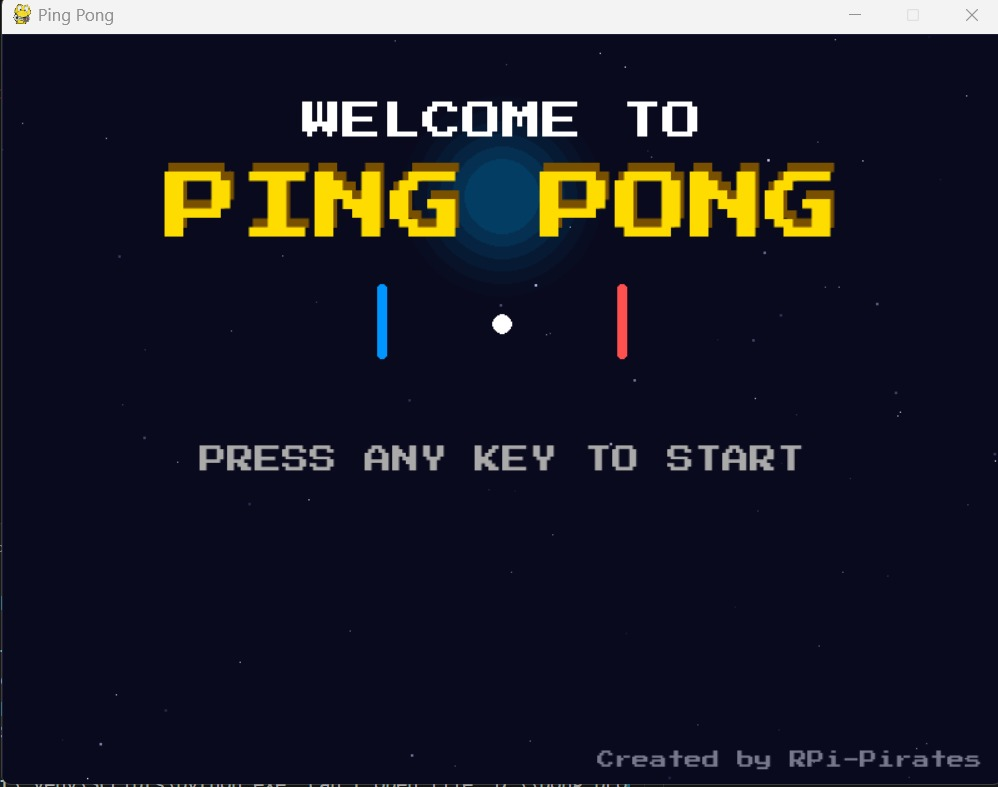

## 1.4 One-Line Pitch

`An interactive, multi-controller ping pong game powered by Raspberry Pi, combining keyboard and mobile inputs with dynamic gameplay and real-time scoring.`

## 1.5 Expanded Project Idea
This project is an interactive digital ping pong game that combines software and hardware to create a dynamic gaming experience. It supports two modes: single-player and multiplayer. In single-player mode, the user plays against a computer-controlled opponent (AI) with selectable difficulty levels such as easy, medium, and hard, which adjust the ball speed and AI responsiveness. In multiplayer mode, two players compete using different input methods, where one player uses a keyboard and the other uses a mobile phone as a controller through a Raspberry Pi. The mobile device sends input signals over Wi-Fi to the Raspberry Pi, which forwards them to the main game running on the PC. The game also includes features such as a pre-game countdown, real-time scoreboard, increasing difficulty, and random power-ups, making the gameplay more engaging and interactive.
# 2. Inspiration

## 2.1 References
| Source Type | Title / Link                                                        | What Inspired You                                                                         |
| ----------- | ------------------------------------------------------------------- | ----------------------------------------------------------------------------------------- |
| `[Video]`   | `(https://www.youtube.com/watch?v=5NkTzvMchMw)o` | `How projection mapping can be used to create interactive digital + physical experiences` 
| `[Game]`    |  `Classic Pong Game ` | `Simple yet engaging gameplay mechanics and competitive two-player interaction `
|`[Technology]`|	`Raspberry Pi`	| `Using hardware like Raspberry Pi to extend traditional computer-based systems`
|`[Concept]`|	`Mobile as Game Controller`| `Using a smartphone as an alternative input device instead of standard controllers`

## 2.2 Original Twist
The originality of our project lies in combining a classic ping pong game with modern, multi-device interaction. Unlike traditional Pong, which relies only on keyboard input, our system integrates a Raspberry Pi to enable a mobile phone to function as a controller alongside keyboard controls. This creates a hybrid interaction model that blends physical and digital inputs.
Additionally, the game introduces dynamic gameplay elements such as increasing ball speed over time, a structured countdown before gameplay, and a personalized scoreboard displaying player names with a defined win condition. The project is further unique in its potential as an interactive installation, where users engage with the system through multiple interfaces, making the experience more immersive and flexible compared to standard desktop games.  

# 3. Project Intent

## 3.1 User Journey 
The user begins by opening the game and clicking on the Play button on the home screen. They are then prompted to select between single-player and multiplayer modes. In single-player mode, the user selects a difficulty level (easy, medium, or hard) and competes against a computer-controlled opponent. In multiplayer mode, two players enter their names, where one player uses the keyboard and the other uses a mobile phone connected via Raspberry Pi as a controller. After setup, the game starts with a countdown, and players control their paddles to hit the ball. The system continuously updates scores, and the first player to reach five points wins the game. The user can pause, exit, or replay the game, and may also encounter power-ups during gameplay that modify speed, controls, or paddle size, adding variety and challenge.
During gameplay, the user may encounter power-ups that randomly appear on the screen. When the ball hits a power-up, special effects are activated, such as increasing paddle size, changing ball speed, or reversing controls. This adds an element of surprise and requires players to quickly adapt their strategy.                                   
# 4. Definition of Success

## 4.1 Definition of “Usable”
 The project is considered usable when a user can easily navigate through all the screens and successfully play the ping pong game without confusion.
A usable system should:
1. Allow the user to start the game from the home screen
2. Let the user choose between one player and two player modes
3. Enable smooth input of player names (for two-player mode)
4. Allow selection of difficulty level (easy, medium, hard)
5. Provide clear controls for gameplay (keyboard/mouse)
6. Display a working game screen with paddles, ball, and scoreboard
7. Update the score correctly when a point is made
8. Show a winner screen when a player reaches 5 points
9. Allow the user to pause, exit, and replay the game
10. If the user can complete a full game cycle (start → play → win → replay), the system is considered usable

## 4.2 Minimum Usable Version
The minimum usable version is the simplest version of the game that still provides the core experience of playing ping pong.
It includes:
1. Basic home screen with Play button
2. Selection of one player mode only (no need for two-player initially)
3. Simple game screen with one paddle (user) and one computer paddle
4. Basic ball movement and collision logic
5. A simple scoreboard
6. Game ends when one player reaches 5 points
7. Display of a basic winner message
This version does not require advanced UI design, sound effects, or animations but must allow the user to play and complete a full game.

## 4.3 Stretch Features
Stretch features are additional improvements that enhance the game but are not required for the basic functionality.
These include:
1. Two-player mode with custom player names
2. Sound effects (ball hit, scoring, win sound)
3. Pause and resume feature (P key)
4. Exit option (ESC key)
5. Replay option (R key)
6. Improved UI/UX design with themes (space/pixel style)
7. Mobile-responsive design
8. Difficulty levels (easy, medium, hard) with increasing ball speed
9. Animations (ball trail, paddle movement effects)
10. Score history or leaderboard
11. Touch controls for mobile devices
12. Power-ups system
These features make the game more engaging and professional but are not necessary for the core gameplay.

# 5. System Overview

## 5.1 Project Type
Check all that apply.

- [x] Electronics-based

- [ ] Mechanical

- [x] Sensor-based

- [ ] App-connected

- [ ] Motorized

- [ ] Sound-based

- [ ] Light-based

- [x] Screen/UI-based

- [ ] Fabricated structure

- [x] Game logic based

- [ ] Installation

- [ ] Other:

## 5.2 High-Level System Description
The Ping Pong Game is an interactive system that allows users to play either against a computer or another player using hybrid controls. Input is provided through a keyboard and a mobile phone controller connected via Raspberry Pi. In single-player mode, the system uses an AI algorithm to control the opponent paddle based on the ball’s movement and selected difficulty level. In multiplayer mode, one player uses the keyboard while the other uses a mobile device, with inputs transmitted through the Raspberry Pi over a Wi-Fi network. The system processes these inputs to control paddle movement, calculate ball direction, detect collisions, update scores, and manage game states. The output is displayed on the screen in the form of gameplay visuals, scoreboard, and winner announcements, providing a complete interactive gaming experience.
The system works as follows:
Input: The user provides input using keyboard keys (W, S, Arrow keys) or mouse (in one-player mode). The user also selects game mode, difficulty level, and enters player names.
Processing: The system processes user inputs and runs the game logic. It controls the movement of paddles, calculates the ball’s direction, detects collisions between the ball and paddles/walls, updates scores, and determines when a player wins. The system processes user inputs and runs the game logic. It controls paddle movement, ball direction, collision detection, scoring, and power-up activation logic, where special effects are triggered when the ball interacts with power-ups.
Output: The output is displayed on the screen in the form of a game interface. It shows the paddles, moving ball, scoreboard, and winner message. Sound effects may also play when the ball hits a paddle or when a player scores.
Physical Structure: The system is software-based and runs on devices like a computer or mobile screen. There is no physical hardware structure required apart from input devices (keyboard/mouse).
App Interaction: The game can run as a web application or local application. The user interacts through UI screens such as home screen, game mode selection, gameplay screen, and result screen.
 
## 5.3 Input / Output Map

| System Part          | Type       | What It Does
|----------------------|------------|----------------------------------------
| Play Button          | Input      | Starts the game
| Mode Selection       | Input      | Chooses one-player or two-player mode
| Name Input Fields    | Input      | Takes player names
| Keyboard (W, S, ↑, ↓)| Input      | Controls paddle movement
| Mouse                | Input      | Controls paddle in one-player mode 
| Level Selection      | Input      | Sets difficulty (ball speed)
| Game Logic Engine    | Processing | Handles movement, collision, scoring
| Ball Movement        | Processing | Calculates direction and speed
| Collision Detection  | Processing | Detects ball hitting paddle/walls
| Scoreboard           | Output     | Displays player scores
| Game Screen          | Output     | Shows paddles, ball, gameplay
| Winner Screen        | Output     | Displays winner and final score
| Sound System         | Output     | Plays sound on hit/score
| Power-ups            | Processing | Generates random effects during gameplay            
| Power-up Effects     | Output     | Alters gameplay (speed, controls, visibility, etc.) 

# 6. System Design, Sketches and Visual Planning 

## 6.1 Concept sketch
The sketch illustrates the user interface flow and screen layout of the ping pong game. It begins with a simple home screen displaying the game title and a play button, ensuring ease of navigation. The next screen allows the user to select between single-player (mouse or AI-based opponent) and two-player mode (keyboard controls). A level selection screen follows, offering options such as easy, medium, and hard, which affect gameplay speed. The main gameplay screen includes paddles on both sides, a moving ball, and a centrally positioned scoreboard that tracks points up to a maximum of five. Finally, a winner screen is displayed once a player reaches the target score, with an option to replay the game. The design focuses on clarity, simplicity, and intuitive interaction for an engaging user experience.

## 6.2 Labeled flow diagram
The flowchart represents the logical sequence of operations in the ping pong game system. The process begins with the start state, followed by the home screen where the user initiates the game by clicking the play button. The user then selects the game mode (single-player or two-player). If two-player mode is chosen, player names are entered. Next, the user selects the difficulty level (easy, medium, or hard), after which the game begins with a countdown. During gameplay, the system continuously updates ball movement, paddle positions, and scores. A decision condition checks whether any player has reached the winning score (5 points). If not, the game continues; otherwise, the winner is declared. The system then provides an option to replay or return to the home screen, completing the cycle.
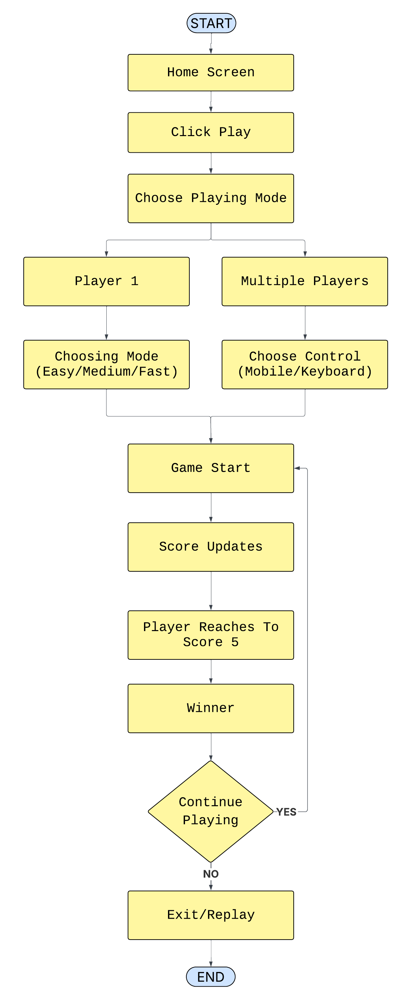

## 6.3 Approximate Dimensions
Not Applicable (NA) – The project is primarily a software-based interactive game and does not involve a fixed or dedicated physical structure with defined dimensions. The system runs on a computer display and uses external devices such as a keyboard and mobile phone for input. While a Raspberry Pi is used for input integration, it is not enclosed within a custom-built physical form factor. Therefore, standard dimensions like length, width, height, and weight are not relevant to this project.

# 7. Electronics Planning

## 7.1 Electronics Used

| Component                | Quantity | Purpose                                          |
|--------------------------|----------|--------------------------------------------------|
| Raspberry Pi             | 1        | Acts as interface between phone controller and PC|
| Mobile Phone             | 1        | Sends control inputs (up/down)                   |
| Wi-Fi Network            | 1        | Enables communication between phone and Pi       |
| PC / Laptop              | 1        | Runs game logic and display (Pygame)             |
| Display Screen/Monitor   | 1        | Shows gameplay, scoreboard, and UI               |
| Keyboard                 | 1        | Controls paddle movement (Player input)          |

## 7.2 Wiring Plan
The system does not involve complex electrical wiring, as it is primarily based on wireless communication and software integration. The Raspberry Pi, mobile phone, and PC are connected through a common Wi-Fi network.
The mobile phone acts as a controller and sends input commands wirelessly to the Raspberry Pi. The Raspberry Pi processes these inputs and forwards them to the PC, where the main game logic is executed using Python and Pygame.
The keyboard is directly connected to the PC and is used for player input in multiplayer mode. The PC is connected to a display screen, which shows the gameplay, including paddles, ball movement, scoreboard, and countdown.
Since there are no high-power components or dedicated circuits, a common electrical ground or physical wiring between components is not required. The system relies entirely on network-based communication for interaction between devices

## 7.3 Circuit architecture diagram
The Ping Pong Game system is designed using a Raspberry Pi as the main processing unit, which controls the entire gameplay. The system takes input from devices such as a keyboard and mouse, where the keyboard is used in two-player mode and the mouse is used in one-player mode to control the paddles. These inputs are processed by the Raspberry Pi, which runs the game logic using software (Python and Pygame). It performs operations such as paddle movement, ball movement, collision detection, score calculation, and winner determination. The processed output is then displayed on a monitor, where the user can visually interact with the game. The system follows a simple input–process–output model, making it efficient and easy to understand. 
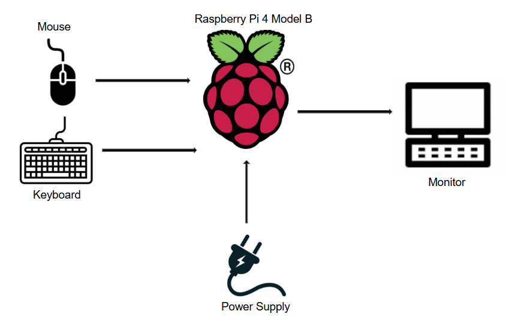

# 7.4. Power Plan

| Question         | Response                                                                                                                |
|------------------|-------------------------------------------------------------------------------------------------------------------------|
| Power source     | `Laptop/PC power supply and Raspberry Pi power adapter (5V USB supply)`                                                 |
| Voltage required | `5V for Raspberry Pi; standard power for PC/laptop and mobile phone`                                                    |
| Current concerns | `Stable power supply required for Raspberry Pi to ensure reliable communication; low overall current consumption`       |
| Safety concerns  | `Use certified power adapters, avoid overloading USB ports, and ensure proper ventilation for devices during operation` |

# 8. Software Planning/

## 8.1 Software Tools

| Tool / Platform        | Purpose                                                   |
|------------------------|---------------------------------------------------------- |
| Python                 | Core programming language for game development            |
| Pygame                 | Game development, rendering graphics, handling input      |
| Raspberry Pi OS        | Runs scripts to receive and forward controller inputs     |
| Socket / HTTP (Wi-Fi)  | Communication between phone, Raspberry Pi, and PC         |
| Mobile Browser/App     | Acts as controller interface (send up/down inputs)        |                             |                                               

## 8.2 Software Logic/Algorithm
Startup behavior:
The system initializes the Pygame window, game objects (paddles, ball), and sets the initial game state to the home screen. The Raspberry Pi establishes a network connection and begins listening for input signals from the mobile phone controller.
Input handling:
Player inputs are received through the keyboard (W/S keys and arrow keys) and from the mobile phone via the Raspberry Pi. These inputs control the vertical movement of paddles in real time.
Sensor reading:
Not applicable, as the system does not use physical sensors. Instead, it relies on user input signals from keyboard and mobile controller.
Decision logic:
The game continuously updates ball position, detects collisions with paddles and boundaries, and determines scoring conditions. Ball speed increases at fixed time intervals (every 7 seconds) to raise the difficulty level. The system also checks if a player has reached the winning score (5 points). The system also includes a power-up generation mechanism, where power-ups spawn at random intervals. When the ball collides with a power-up, the corresponding effect is activated temporarily, modifying gameplay conditions such as speed, paddle size, or controls.
Output behavior:
The game renders real-time visuals on the screen, including paddle movement, ball motion, countdown timer, scoreboard with player names, and winner announcement.
Communication logic:
The mobile phone sends control inputs over Wi-Fi to the Raspberry Pi. The Raspberry Pi processes and forwards these inputs to the PC game, enabling wireless control of the paddle.
Reset behavior:
After each point, the game enters a short pause state and resets the ball position. A countdown is displayed before the next round begins. The entire game resets when a player reaches 5 points or when the user restarts the game.

## 8.3 Code Flowchart
The flowchart represents the step-by-step working of the Ping Pong Game system. The process begins with the start of the program, after which the home screen is displayed to the user. From the home screen, the user clicks on the play option, which takes them to the mode selection screen where they can choose between one-player or two-player mode.
If the user selects two-player mode, they are required to enter the player names, while in one-player mode this step is skipped. After that, the user selects the difficulty level such as easy, medium, or hard, which determines the speed and complexity of the game.
Once the setup is complete, the game starts, and the main gameplay begins. In this stage, the ball moves continuously, and players control their paddles to hit the ball. The score updates automatically whenever a player misses the ball and the opponent gains a point.
A decision condition is then checked: whether any player has reached 5 points. If no player has reached the winning score, the game continues in a loop. If a player reaches 5 points, the system displays the winner screen, announcing the winner.
Finally, the user is given an option to replay the game, and upon selection, the system returns to the home screen, completing one full cycle of the game flow. 
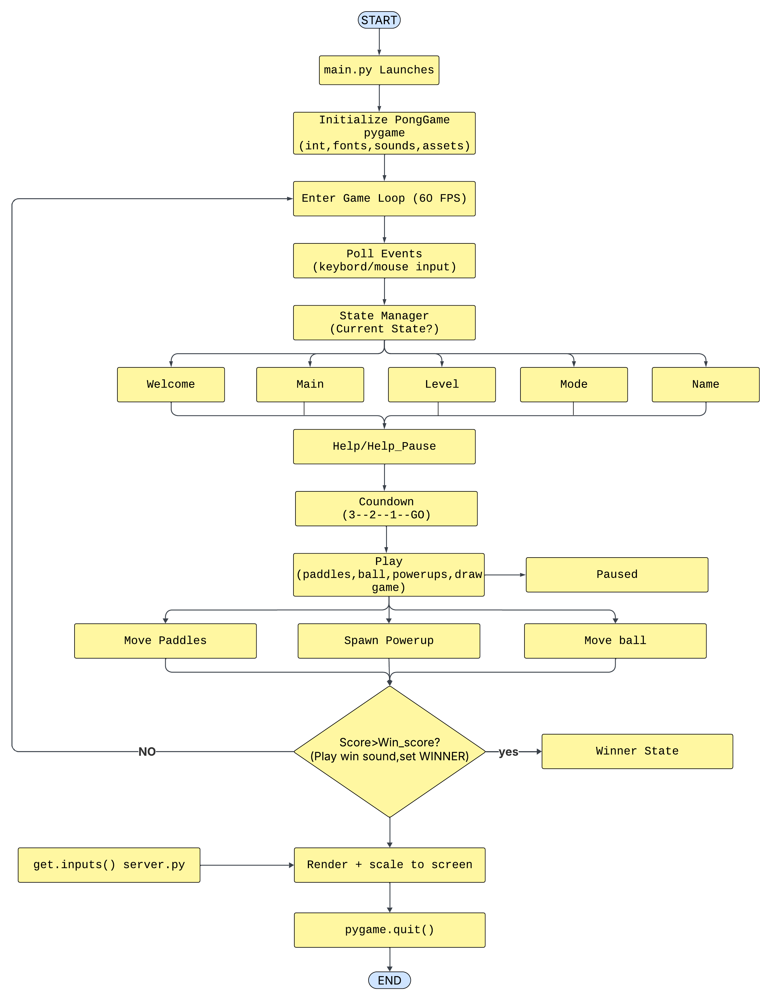

# 9. Bill of Materials

## 9.1 Full BOM
| Item                     | Quantity | In Kit? | Need to Buy? | Estimated Cost | Material / Spec                | Why This Choice?                               |
|--------------------------|---------:|--------|--------------|---------------:|-------------------------------|--------------------------------------------------|
| Raspberry Pi             | 1        | Yes    | No           | 0              | 5V Micro USB / USB-C powered  | Acts as bridge between phone controller and PC   |
| PC / Laptop              | 1        | Yes    | No           | 0              | Standard system with Python   | Runs game logic using Pygame                     |
| Mobile Phone             | 1        | Yes    | No           | 0              | Android/iOS device            | Used as wireless controller                      |
| Wi-Fi Network            | 1        | Yes    | No           | 0              | Local network connection      | Enables communication between devices            |
| Display Screen/Monitor   | 1        | Yes    | No           | 0              | HDMI-compatible display       | Displays gameplay and UI                         |
| Keyboard                 | 1        | Yes    | No           | 0              | Standard USB keyboard         | Provides player input                            |

## 9.2 Material Justification
The components were selected to support a software-driven interactive game with minimal hardware dependency. The Raspberry Pi was chosen as it provides a compact and efficient platform for handling communication between the mobile phone and the PC. It allows flexible integration of wireless inputs without requiring complex circuitry.
A PC or laptop was used to run the main game logic using Python and Pygame, as it offers sufficient processing power and graphical capabilities. The mobile phone was selected as a controller because it is easily available and enables wireless, user-friendly interaction. A Wi-Fi network is used instead of wired connections to simplify setup and improve flexibility.
Overall, the design avoids unnecessary hardware components such as motors or drivers, making the system cost-effective, simple to implement, and focused on interaction and gameplay rather than mechanical complexity.

## 9.3 Items You chose

| Item               | Why Needed                                       | Purchase Link | Latest Safe Date to Procure | Status      |
|--------------------|--------------------------------------------------|---------------|-----------------------------|-------------|
| Raspberry Pi       | To receive and forward mobile controller input   | Available     | Already available           | Received    |
| Mobile Phone       | Acts as wireless controller                      | Personal      | Already available           | In Use      |
| PC / Laptop        | Runs game logic (Pygame)                         | Personal      | Already available           | In Use      |
| Wi-Fi Network      | Enables communication between devices            | Available     | Already available           | Active      |
| Keyboard           | Player input for gameplay                        | Available     | Already available           | In Use      |

## 9.4 Budget Summary

| Budget Item           | Estimated Cost (₹) |
|-----------------------|-------------------:|
| Electronics           | 0                  |
| Mechanical parts      | 0                  |
| Fabrication materials | 0                  |
| Purchased extras      | 0                  |
| Total                 | 0                  |

## 9.5 Budget Reflection

The overall cost of the project is minimal because it primarily relies on existing devices such as a PC, Raspberry Pi, and mobile phone. No additional hardware components like motors, drivers, or fabrication materials were required.
If further cost reduction were needed, the Raspberry Pi could be eliminated by directly connecting the mobile controller to the PC using network-based communication, making the system entirely software-based. Additionally, shared devices and open-source tools were used to avoid any licensing or hardware expenses.
This approach demonstrates that interactive systems and games can be developed efficiently without high costs, by leveraging existing resources and focusing on software integration rather than hardware complexity.

# 10. Planning the Work

## 10.1 Team Working Agreement
The team divided responsibilities based on key components of the project. Members Sudarsana and Shabarinath focused on developing the core functionality, including game coding using Pygame and implementing the mobile phone controller through the Raspberry Pi. Members Pragnya and Aditi worked on the user interface, overall system integration, and project documentation.
Decisions were made collaboratively through regular discussions, ensuring that all team members contributed ideas before finalizing any major changes. Progress was tracked through frequent check-ins and testing sessions, where each module was reviewed and integrated step by step.
If any task was delayed, responsibilities were adjusted within the team to provide support and ensure timely completion. Documentation was maintained continuously alongside development, with updates made after each major milestone to keep the report accurate and up to date.

## 10.2 Task Breakdown

| Task ID | Task                                              | Owner                     | Estimated Hours | Deadline  | Dependency      | Status |
|---------|---------------------------------------------------|---------------------------|----------------:|-----------|-----------------|--------|
| T1      | Basic Pong setup (PC + keyboard controls)         | All                       | 1.5             | Same Day  | None            | Done   |
| T2      | Multiplayer via phone controller (Raspi)          | Sudarsana, Shabarinath    | 1.5             | Same Day  | T1              | Done   |
| T3      | Single player mode (AI opponent)                  | Sudarsana, Shabarinath    | 1               | Same Day  | T1              | Done   |
| T4      | UI features (countdown, scoreboard, names)        | Pragnya, Aditi            | 1               | Same Day  | T1              | Done   |
| T5      | Integration of all modules                        | Pragnya, Aditi            | 0.5             | Same Day  | T2, T3, T4      | Done   |
| T6      | Testing and debugging                             | All                       | 0.5             | Same Day  | T5              | Done   |
| T7      | Documentation and final report                    | Pragnya                   | 0.5             | Same Day  | T6              | Done   |

## 10.3 Responsibility Split

| Area              | Main Owner                | Support Owner              |
|-------------------|---------------------------|----------------------------|
| Concept           | Sudarsana                 | Shabarinath                |
| Electronics       | Sudarsana                 | Shabarinath                |
| Coding            | Shabarinath               | Sudarsana                  |
| UI / Interface    | Pragnya                   | Aditi                      |
| Integration       | Aditi                     | Pragnya                    |
| Testing           | All                       | -                          |
| Documentation     | Pragnya                   | Aditi                      |

# 11 hour Milestones

## 11.1 8-hour Plan

Bi Hour 1 — Planning and Setup
Expected outcomes:
 1. Idea finalized
 2. Game flow (menus, modes, scoring) decided
 3. UI sketches and flowchart created
 4. Software tools finalized (Python, Pygame)
 5. Basic game window and environment setup
 6. Feasibility of controls tested

Bi Hour 2 — Core Game Development
Expected outcomes:
 1. Basic Pong mechanics implemented (ball + paddles)
 2. Keyboard controls working
 3. Collision detection implemented
 4. Scoring system added
 5. Initial playable version created

Bi Hour 3 — Advanced Features & Integration
Expected outcomes:
 1. Mobile controller integrated via Raspberry Pi
 2. Single-player mode (AI opponent) implemented
 3. Game states added (home, mode select, gameplay)
 4. Countdown system implemented
 5. First full-feature playable version ready

Bi Hour 4 — UI, Testing, and Finalization
Expected outcomes:
 1. UI improvements (buttons, scoreboard, player names)
 2. Difficulty levels implemented (speed increase)
 3. Testing and debugging completed
 4. Documentation completed
 5. Final version ready for submission
 
## 12.2  Update Log

| Hours        | Planned Goal                                   | What Actually Happened                                      | What Changed                                              | Next Steps                          |
|--------------|------------------------------------------------|-------------------------------------------------------------|-----------------------------------------------------------|-------------------------------------|
| 0–0.25 hr    | Plan idea, flow, and UI                        | Finalized concept, basic flow, and rough sketches           | Kept scope minimal to fit within time                     | Start core development              |
| 0.25–2 hr    | Build basic Pong game                          | Implemented paddles, ball movement, keyboard controls       | Simplified logic for faster implementation                 | Add scoring and features            |
| 2–3 hr       | Add scoring and game mechanics                 | Added collision detection, scoring system                   | Adjusted ball speed for better gameplay                   | Integrate controller and AI         |
| 3–4 hr       | Add phone controller and AI                    | Integrated Raspberry Pi input and basic AI opponent         | Faced minor delays in communication setup, resolved later  | Improve UI and polish               |
| 3–6 hr       | Documentation (parallel work)                  | Documentation written alongside development                 | Updated continuously instead of end-only writing           | Finalize report                     |
| 4–6 hr       | UI, testing, and final refinement              | Added countdown, levels, scoreboard, completed testing      | Fixed bugs and improved responsiveness                    | Final submission ready              |

# 13. Risks and Unknowns

## 13.1 Risk Register

| Risk                                                     | Type        | Likelihood | Impact | Mitigation Plan                                                                 | Owner         |
|----------------------------------------------------------|------------|------------|--------|----------------------------------------------------------------------------------|---------------|
| Wi-Fi communication delay between phone and Raspberry Pi  | Technical  | Medium     | High   | Use stable network, minimize latency, add fallback keyboard control             | Sudarsana     |
| Input lag or unresponsive controls                        | Technical  | Medium     | High   | Optimize code, reduce processing load, test responsiveness                       | Shabarinath   |
| Game bugs (collision, scoring errors)                     | Technical  | Medium     | Medium | Test each module separately and debug during integration                         | Pragnya       |
| Integration issues between controller and game            | Technical  | Medium     | High   | Incremental integration and continuous testing                                   | Aditi         |
| Time constraint (short development time)                  | Planning   | High       | Medium | Prioritize core features and reduce non-essential additions                      | All           |
| UI confusion for users                                    | Design     | Low        | Medium | Keep interface simple and intuitive, test with users                             | Pragnya       |

## 13.2 Biggest Unknown Right Now
The biggest uncertainty in our project was the reliability and responsiveness of the communication between the mobile phone controller, Raspberry Pi, and the PC game. Since the system depends on real-time input for smooth gameplay, any delay, lag, or connection instability could directly affect player control and overall experience. Ensuring that inputs from the phone are transmitted quickly and accurately to the game without noticeable latency was a key challenge that required testing and adjustment during development.

# 14. Testing 

## 14.1 Technical Testing Plan

| What Needs Testing                  | How You Will Test It                                              | Success Condition                                              |
|------------------------------------|-------------------------------------------------------------------|----------------------------------------------------------------|
| Wi-Fi communication (phone → Pi → PC) | Send repeated inputs from phone and observe paddle movement        | Paddle responds instantly without noticeable lag               |
| Keyboard controls                  | Press keys (W/S, Arrow keys) during gameplay                      | Paddles move smoothly and accurately                          |
| Ball movement and collision        | Run game and observe ball bouncing off walls and paddles          | Ball reflects correctly without glitches                      |
| Scoring system                     | Allow ball to cross boundaries                                    | Score increments correctly for respective player              |
| Countdown system                   | Start game multiple times                                         | Countdown displays correctly before gameplay                  |
| Difficulty levels                  | Run game for extended time                                        | Ball speed increases every 7 seconds                          |
| Game win condition                 | Play until one player reaches 5 points                            | Winner is declared correctly                                  |
| UI and display                     | Observe all screens (menu, gameplay, result)                      | Text and buttons display clearly and correctly                |

## 14.2 Testing and Debugging Log

| Date         | Problem Found                              | Type        | What You Tried                                      | Result     | Next Action                          |
|--------------|--------------------------------------------|------------|----------------------------------------------------|------------|--------------------------------------|
| Same Day     | Paddle not responding to phone input        | Technical  | Checked Wi-Fi connection and input mapping          | Worked     | Optimize response time               |
| Same Day     | Ball collision behaving incorrectly         | Technical  | Adjusted collision logic and speed values           | Worked     | Fine-tune gameplay physics           |
| Same Day     | Delay in input response                     | Technical  | Reduced processing load and optimized code          | Improved   | Further reduce latency if possible   |
| Same Day     | UI elements overlapping                     | Design     | Adjusted positioning and font sizes                 | Fixed      | Improve visual layout                |
| Same Day     | Score not updating correctly                | Technical  | Debugged scoring conditions                         | Fixed      | Add edge-case checks                 |

## 14.3 Playtesting Notes

| Tester        | What They Did                                  | What Confused Them                          | What They Enjoyed                              | What You Will Change                              |
|---------------|-----------------------------------------------|---------------------------------------------|------------------------------------------------|---------------------------------------------------|
| Sudarsana     | Played both 1-player and 2-player modes        | Slight delay in phone controller response    | Competitive gameplay and increasing speed       | Improve controller responsiveness                 |
| Shabarinath   | Tested UI navigation and gameplay flow         | Initially unclear mode selection flow        | Countdown and smooth gameplay experience        | Make buttons more prominent                       |
| Pragnya       | Played until win condition (5 points)          | Difficulty increase felt sudden              | Fast-paced gameplay and scoring system          | Smoothen speed increment                          |
| Aditi         | Used keyboard and observed scoreboard         | Score visibility at top was small            | Simple controls and easy-to-understand rules    | Increase scoreboard size                          |

# 15. Build Documentation

## 15.1 Fabrication Process(if any)
Not Applicable (NA) – The project does not involve a dedicated physical fabrication process. It is primarily a software-based system developed using Python and Pygame, where the main interaction occurs through a digital interface displayed on a screen.
There was no requirement for processes such as cutting, 3D printing, or structural assembly. The setup only involved connecting existing devices such as a PC, Raspberry Pi, keyboard, and mobile phone. These components were used in their standard form without any modification or custom fabrication.
Minor setup included arranging the system for usability, such as ensuring proper device placement and stable network connectivity between the mobile phone, Raspberry Pi, and PC. Any iterations in the project were focused on improving the software—refining gameplay logic, user interface, responsiveness, and interaction—rather than modifying physical components.

## 16 Build Photos

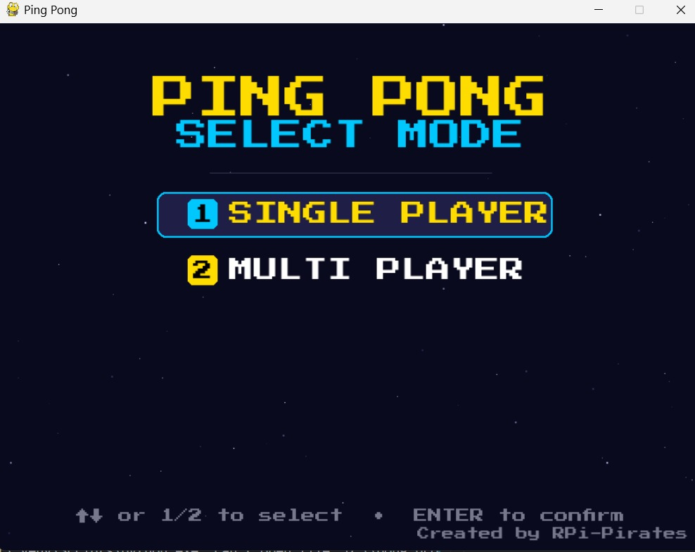
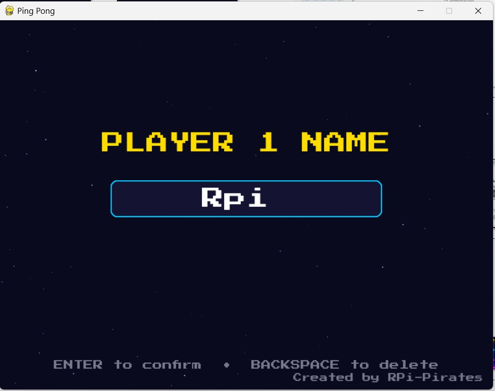
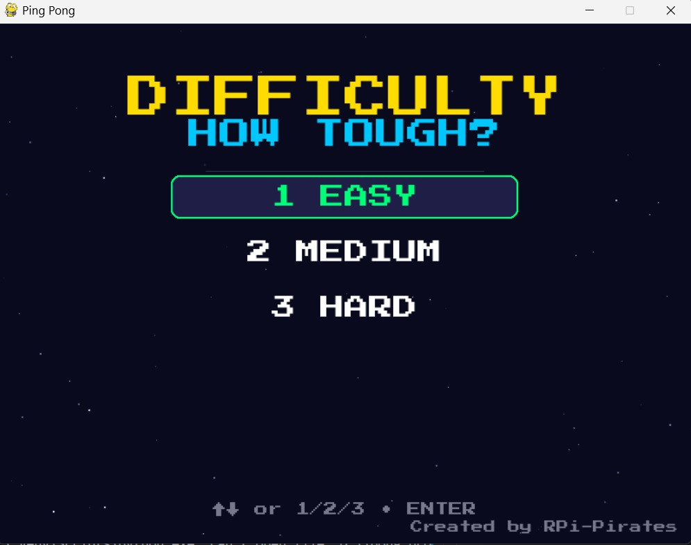
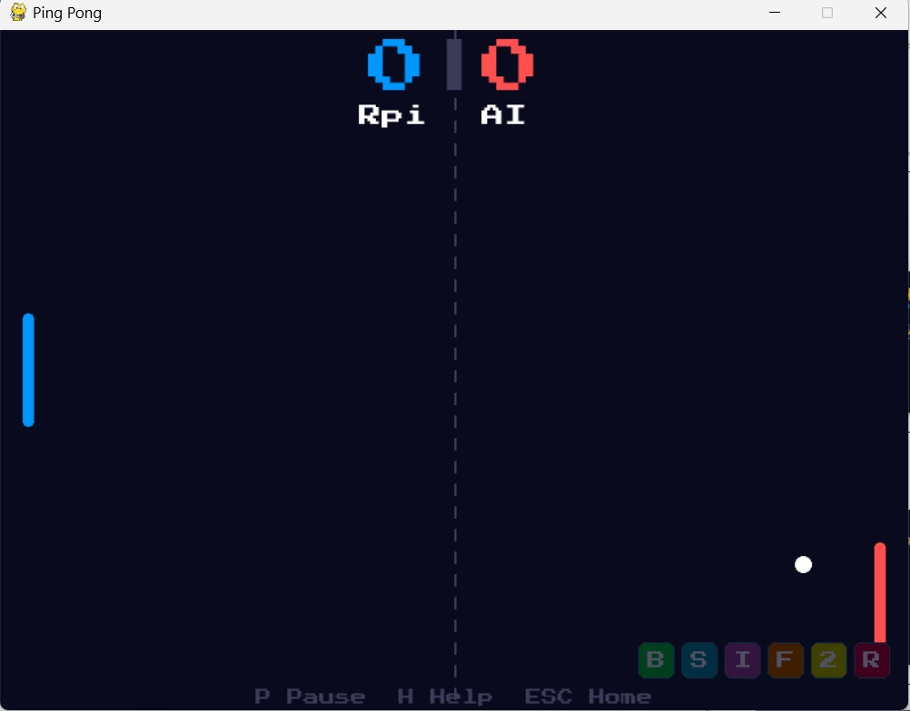
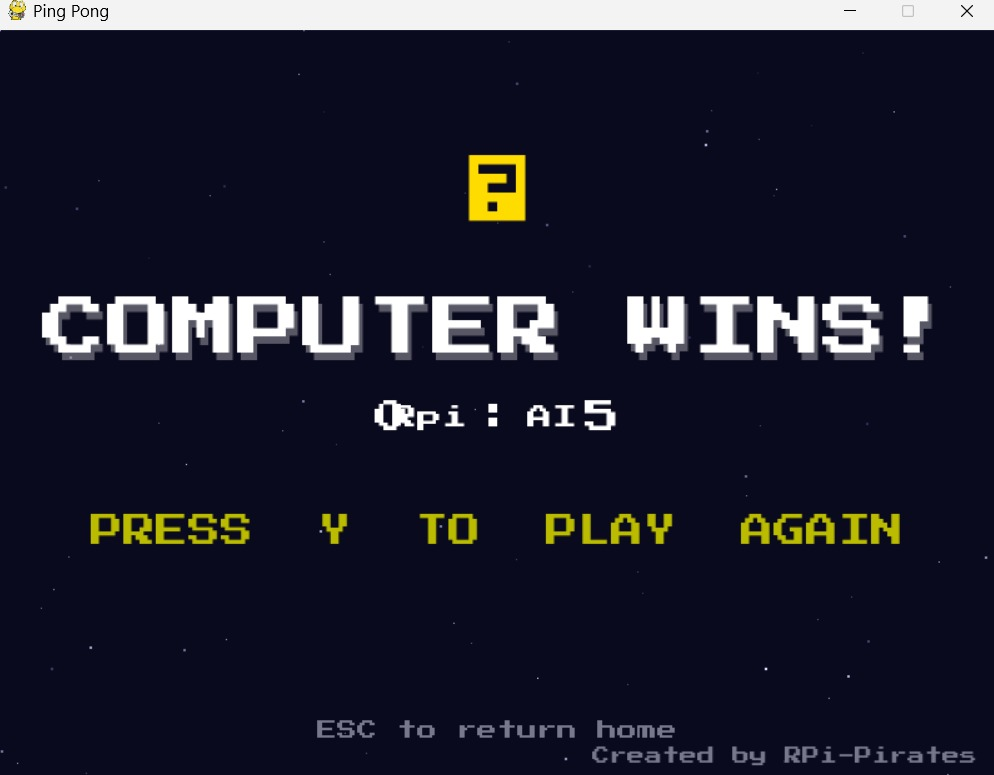
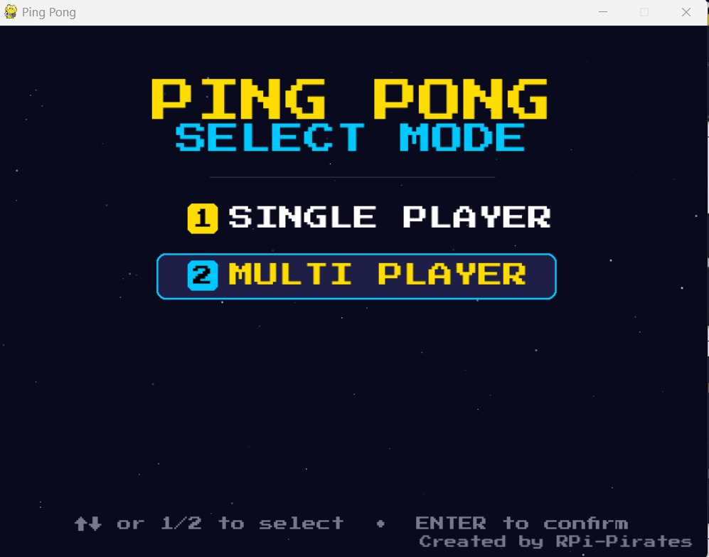
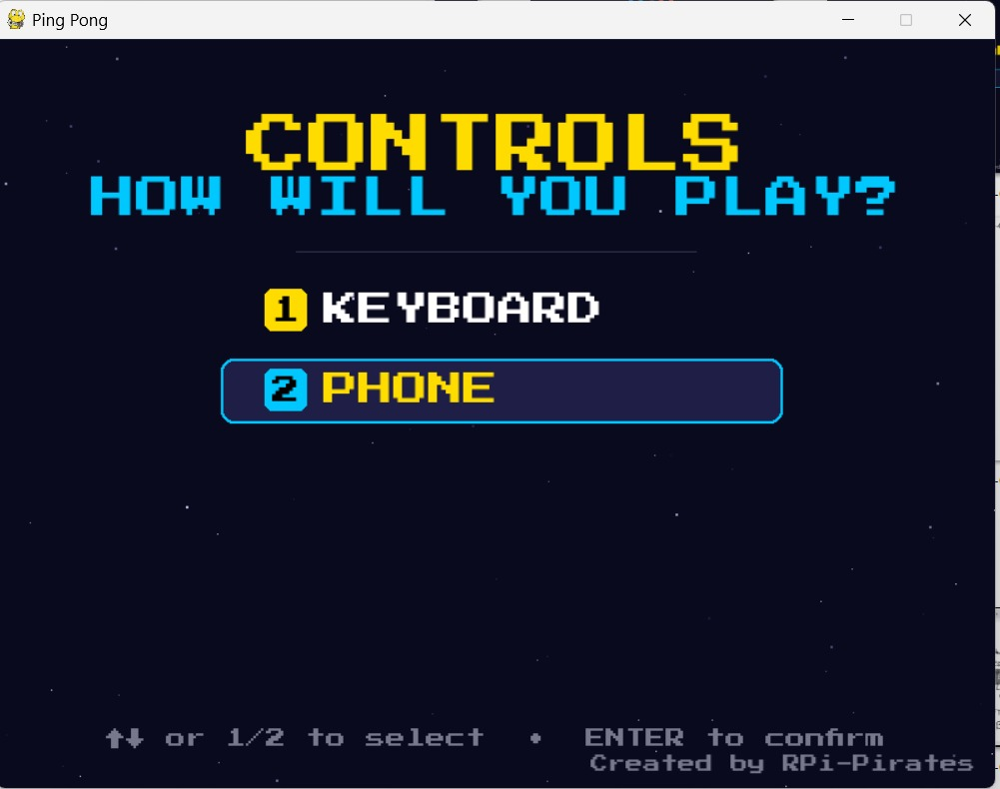
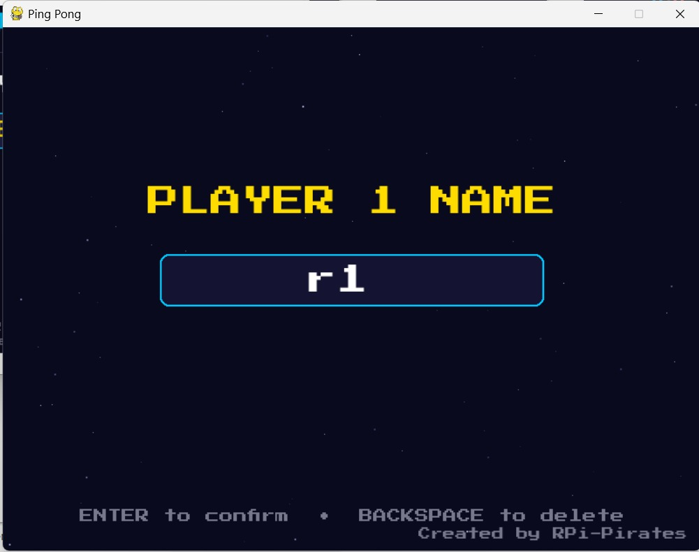
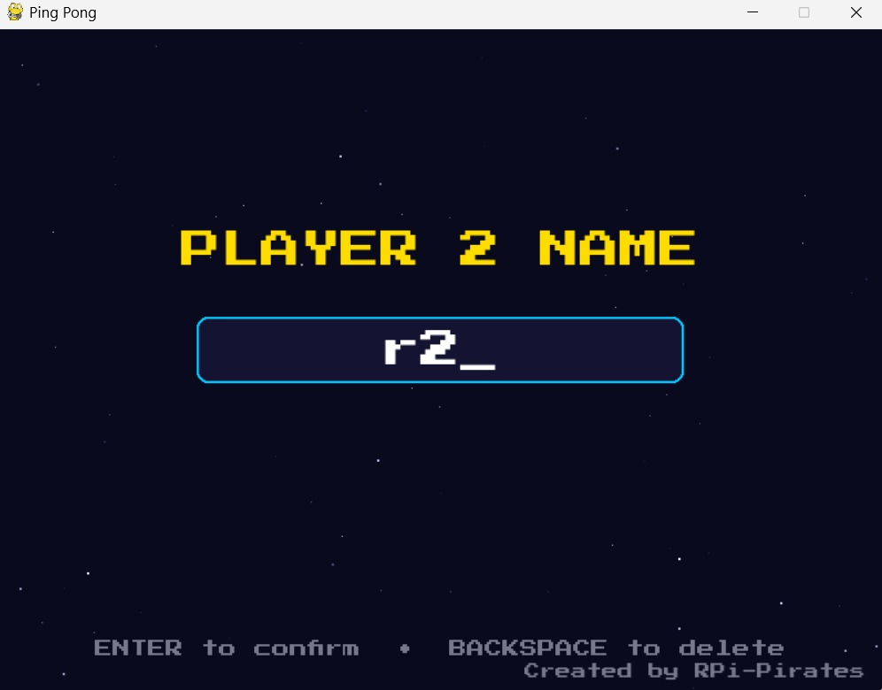
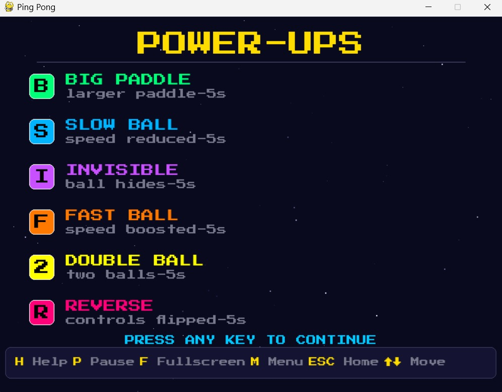
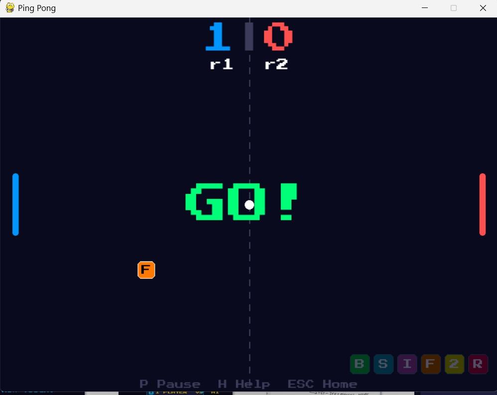
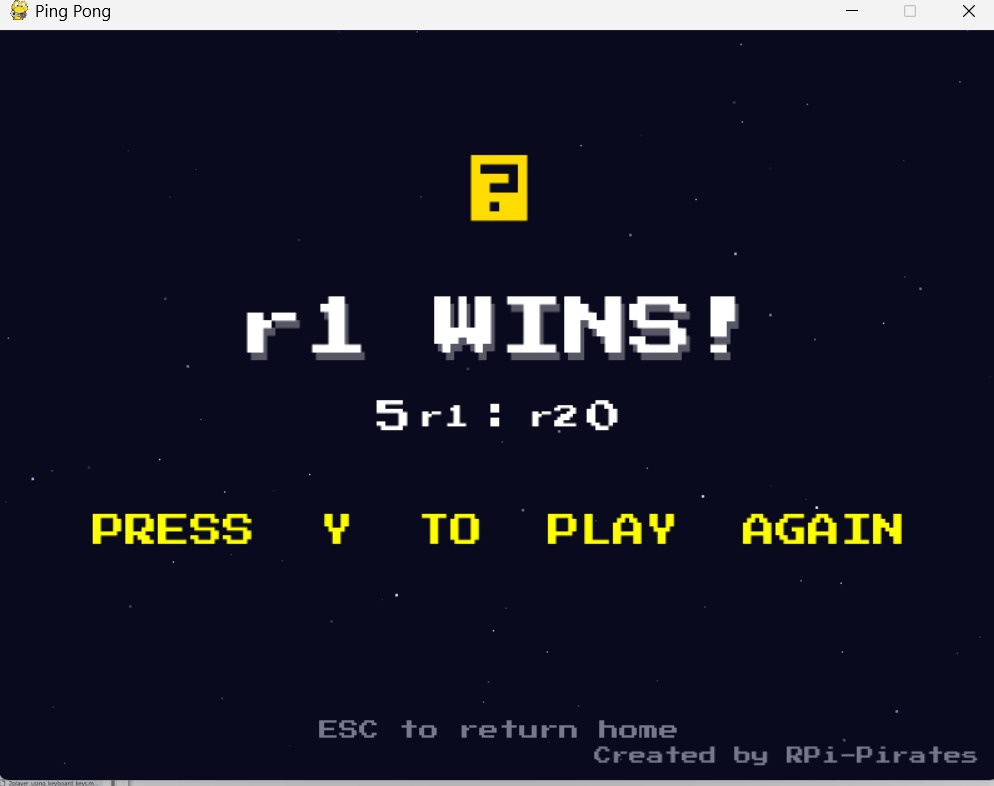

# 17. Final Outcome

## 17.1 Final Description
The final project is a fully functional interactive ping pong game developed using Python and Pygame, integrated with a Raspberry Pi-based mobile controller system. It features two modes: single-player mode, where the user competes against a computer-controlled opponent with adjustable difficulty levels, and multiplayer mode, where one player uses a keyboard and the other uses a mobile phone as a controller. The system successfully integrates multiple input methods and provides real-time gameplay with features such as a countdown, dynamic scoring system, increasing difficulty, and power-ups. The project demonstrates effective integration of software and hardware components to create an engaging and flexible gaming experience. The difficulty level increases dynamically as the ball speed rises over time, making the gameplay more challenging and engaging. The game is further enhanced with a power-up system, introducing dynamic gameplay effects such as speed changes, paddle size variation, and control inversion, making each match unique and more engaging.

## 17.2 What Works Well
1. Smooth and responsive gameplay with real-time paddle and ball movement
2. Successful integration of mobile phone controller via Raspberry Pi
3. Clear and intuitive user interface with multiple game states
4. Functional scoreboard and win condition logic
5. Dynamic difficulty increase enhances player engagement
6. Power-ups add excitement and unpredictability to gameplay

## 17.3 What Still Needs Improvement
1. Minor latency in mobile controller input can be further reduced
2. AI opponent can be made more intelligent and adaptive
3. UI can be enhanced with better visuals, animations, and sound effects
4. Difficulty progression can be made more gradual for better balance

## 17.4 What Changed From the Original Plan
Initially, the project scope included exploring more complex features and extended interactions. However, due to time constraints, the focus was shifted towards building a stable and functional core system. Some advanced features were simplified or removed to ensure smooth gameplay and reliable integration between the Raspberry Pi, mobile controller, and PC. The final implementation prioritizes usability, responsiveness, and essential game mechanics, resulting in a well-structured and fully working system within the given timeframe.

# 18. Reflection

## 18.1 Team Reflection
The team worked efficiently by dividing tasks based on strengths, which helped in completing the project within a short time. Coding and controller integration were handled in parallel with UI design and documentation, allowing faster progress. One of the key strengths was continuous communication and quick decision-making, which helped resolve issues without delays.
The main factor that slowed us down was the initial setup of communication between the mobile controller, Raspberry Pi, and PC, as it required debugging and testing to ensure smooth input transfer. However, once resolved, development progressed rapidly.
Time and task management were handled effectively despite the limited duration. The team adopted a parallel working approach, where multiple components were developed simultaneously, and responsibilities were clearly defined. This ensured that all major features were implemented within the 6-hour development window.

## 18.2 Technical Reflection
Through this project, we gained practical experience in multiple areas. In terms of electronics, we learned how to use the Raspberry Pi as an interface for handling wireless communication between devices. In coding, we improved our understanding of game development using Python and Pygame, including handling real-time input, collision detection, and state management.
Although the project did not involve mechanical systems or fabrication, we understood how to design systems that rely purely on software interaction. We also learned the importance of integration—ensuring that different components such as the mobile controller, Raspberry Pi, and game engine work together seamlessly. Overall, the project strengthened our ability to build interactive systems by combining programming, networking, and user interface design.

## 18.3 Design Reflection
Through this project, we learned that good design is not just about visuals but about creating a smooth and intuitive user experience. While designing the game, we focused on clarity by keeping the interface simple, ensuring that users could easily understand how to navigate between screens and play the game without confusion. We also realized the importance of delight—features like the countdown, increasing speed, and competitive scoring made the game more engaging and enjoyable.
Even though the project did not involve complex physical interaction, integrating a mobile phone as a controller introduced a new layer of interaction, making the experience more dynamic. We understood that user behavior plays a key role in design decisions, and small issues like unclear buttons or delayed responses can affect the overall experience.
Iteration was a crucial part of our process. Based on testing and feedback, we continuously refined gameplay speed, UI layout, and responsiveness. This helped us improve both functionality and usability, showing that good design evolves through testing and improvement rather than being perfect from the start. 
The introduction of power-ups significantly improved player engagement by adding unpredictability and strategic depth to the gameplay.

## 18.4 If You Had One More hour
If we had one more hour, we would focus on enhancing the overall user experience and polish of the game. This would include improving the responsiveness of the mobile controller to reduce any remaining input delay and making the AI opponent more intelligent and adaptive.
We would also enhance the visual design by adding animations, sound effects, and better graphics to make the game more engaging. Additionally, we would refine the difficulty progression to ensure a smoother increase in challenge. These improvements would not change the core functionality but would significantly improve the quality and feel of the final product.

# 19. Final Submission Checklist

- [x] Team details are complete
- [x] Project description is complete
- [x] Inspiration sources are included
- [x] Sketches are added
- [x] BOM is complete
- [x] Purchase list is complete
- [x] Budget summary is complete
- [x] Mechanical planning is documented if applicable
- [x] App planning is documented if applicable
- [x] Code flowchart is added
- [x] Task breakdown is complete
- [x] Weekly logs are updated
- [x] Risk register is complete
- [x] Testing log is updated
- [x] Playtesting notes are included
- [x] Build photos are included
- [x] Final reflection is written
